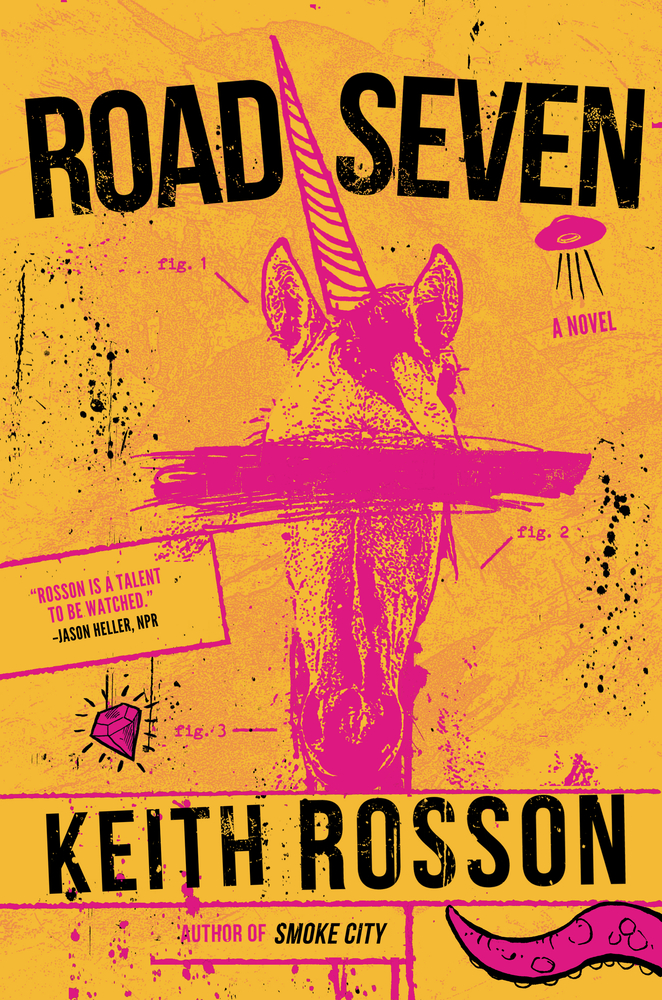

_Road Seven_ is an adventurous romp that unfortunately falls flat at the end. This is the first novel I've read from Keith Rosson, and I had high hopes at the outset.

Unfortunately, the two main characters are not at all likable. Brian is a hot mess, and Mark is either crazy or an excellent liar. 

First, we meet Brian. An unsuccessful, 30-year-old almost-Ph.D., he is thinking of dropping out. After responding to a bizarre online ad on a monster hunter website, Brian joins Mark Sandoval on an expedition to find a unicorn. With a background in anthropology and the historical significance of mythical creatures, Brian is uniquely suited to be Mark's research assistant on this project.

Mark is ultra-famous. This is primarily due to his memoir—in which he claims to have been abducted by aliens. Some people believe this is the truth, and Mark has traded on this fame for decades.

The writing holds it all together almost until the end. As we progress to the climax of the novel, there is a theme of truth versus lies. There are a few possibly surprising twists as to what's true and what's not.

However, in the end, there is a "big reveal." This is where _Road Seven_ falls off a cliff. There is a complete lack of motivation and reason behind the reveal, and it's just very out of place, in my opinion, with the rest of the novel. 

It's like this man says, "well since you're here, I **have** to show you this." And the reader—me, in this case—is thinking, uh no you don't. You **want** to, but it is entirely unclear why. This made me so angry. It was so pointless and very much felt like the author just wanted it to have a crazy ending and he couldn't come up with a plausible reason, so he forced it. With no character motivation, no purpose.

I wish it had ended some other way. I enjoyed most of the story up to the end, despite not feeling much empathy or concern for our main characters. 

★★★

Thanks to Book Sirens for a free copy in exchange for a fair and honest review. All opinions here are my own.
