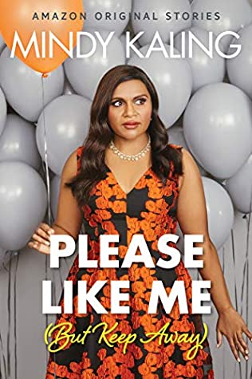

Most of my friends and co-workers know I'm a huge fan of Dwayne "The Rock" Johnson. What fewer people know is that I'm also a huge fan of Mindy Kaling.  
  
Ok, ok. I'm sure you're thinking, "what the heck do Dwayne Johnson and Mindy Kaling have in common?" The truth is, they are both amazing people. I think they are remarkable role models in a time where that's a really awesome thing to be and something we all need right now.  
  
I won't go into all the many, many reasons I love Dwayne Johnson since this post is about my girl-crush Mindy.  
  
Mindy recently published a collection of short essays titled Nothing Like I Imagined (Except For Sometimes). I listened to them all within a few days. Audible is the way to go since Mindy narrates them all herself.  
  
In these essays, Mindy primarily focuses on recent events in her life and being a single mother. So... I knew Mindy had a daughter, and it had briefly crossed my mind in the last year or two to wonder who's the father. However, I did not spend any time trying to find out the answer to this. And guess what? In her essay collection, Mindy talks about not being married, about being a single mom, and such. So I googled it. The paternity of her daughter, Kit, is a big fat secret, AND NOBODY KNOWS WHO THE FATHER IS. Not even her close friends. Mindy says until Kit is old enough to be told, no one else needs to know. Kit should know first. I respect that.  
  
On top of that, I learned that Mindy recently announced that she gave birth to Spencer in September. NO ONE EVEN KNEW SHE WAS PREGNANT. Again, secret baby daddy.  
  
I follow Mindy on Instagram, and I recall seeing all these great photos of her looking glamorous at home during quarantine. Turns out 99% of the photos are old, and of course, that's why Mindy is clearly not pregnant in these photos.

Now, obviously, secret pregnancies and secret baby daddies are not the reason I think Mindy is amazing. She's a woman, a person of color, and she's freaking awesome. She managed to work her way from The Office writers' room, to a role on the show, to her own show. And now she is "mostly producing."

Hollywood needs more female voices. We need more women in power and more women of color. And while Mindy is obsessed with Instagram, her posts are also usually down to earth. She may look glamorous and beautiful, but she is also open about her struggle with weight and the fine balance she has achieved between her love for running and her love for cheeseburgers and fries. You have to admit, the woman has got style!

I also identify with Mindy a lot. I too love running and struggle with my weight because I love food. And in her essays, she talks about her social anxiety. I've never thought to use that term for myself before. However, the way she describes it sounds so much like me! I used to say "oh, I'm an extrovert, but I'm shy." Now, I'm thinking social anxiety is probably a better description. If only I were 1/4 as funny as she is.

My favorite line from Mindy's essay collection is (paraphrasing here) "If my choices are 15 minutes of boring sex every night with the same man, or fifteen minutes on Instagram, I choose Instagram."

I think Mindy is setting a great example for women: you don't need a man to be happy, rich, successful, raise a child...

Also, she is hilariously funny. Just watch the Mindy Project. You'll see. If you watched the office, and you hated Kelly Kapoor, and you're not a Mindy fan because of that... please, please give Mindy another chance. Watch the Mindy Project. Follow her on Instagram. Or check out one of her books or her collection of essays. You won't be disappointed.

Oh and a funny coincidence? My first dog was named Mindy.
