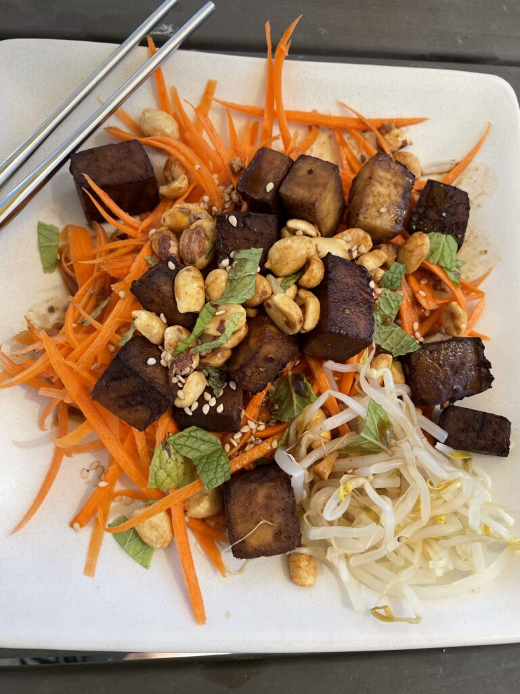

We’ve been sitting at home for over a year now, and I know many feel like they haven’t been living a healthy lifestyle during quarantine. With a global pandemic, and many people forced into quarantine, daily routines have been disrupted, gyms have been closed, and eating habits have changed.

So what is a healthy lifestyle? I like to think of this as the four pillars of health, almost like supports that hold up a building. The first one is food. You can probably guess the second, but the final two might surprise some - I’ll talk about all these in future posts, so look for those coming soon!

I chose to name the first pillar food rather than diet for several reasons. First off, the word diet has multiple meanings. I want to discuss, in the most general sense, what healthy foods and healthy eating habits look like. If I say diet, many people will initially think about methods for losing (or gaining!) weight such as macro or calorie counting, calorie limitations, and so forth. This is not my focus.

Here in the US, the joke is our diet is SAD - standard American diet. This is the fast food, high fat, high carb/sugar, too large portions, and almost entirely processed foods diet that has become mainstream. This is not healthy eating.

So what does healthy eating look like? First off, I don’t think there’s one specific magic diet and I don’t think the same things work for everyone for weight control or weight loss. What I want to talk about instead is general healthy eating.

Plants. Ok, yes, I’m a vegetarian. Still! Everyone should be eating plants, specifically vegetables, and fruits. There’s a saying I’ve heard “eat the rainbow”. This is great advice. Different colored fruits and veggies have different benefits, mainly in the form of vitamins and minerals.

<figure>

<figcaption>

carrot salad with tofu, peanuts, mint, and bean sprouts

</figcaption>

</figure>

I’m a firm believer that sugar, specifically processed or refined sugar, is the worse thing for us, health-wise. There’s a lot of evidence it causes obesity, diabetes, heart disease, and many other “diseases of western civilization.” I will admit that I am a little teeny teeny tiny bit addicted to high sugar content drinks. I am REALLY trying to kick this habit, because I feel this the number one thing that I personally could do to be healthier. (If you're interested in more on this topic please go read this book, it might change your life!)

So...eat lots of plants of various colors, and avoid refined or added sugars. I could go on to say eat low carb, or keto, or do intermittent fasting, but those don’t work for everyone, they aren’t necessary for healthy eating, and I’m sticking with the pillars, _the basics,_ for this post.

Also, I'd like to add that I don't think there's anything that you should never, ever, eat. (Well maybe not cyanide, or dog poop, or ... you get what I mean...). Honestly, I think moderation is everything, but also that moderation doesn't work for everyone. So if you love ice cream, HAVE ICE CREAM. Just don't eat a gallon of it at a time, every day. But if having a little bit of ice cream, occasionally is hard for you, if you're like me and you'll go nuts having it in the house, then maybe being more restrictive is better. I'm not really a fan of cheat days, because I feel often that's just an excuse to overindulge and eat really poorly. Rather than shoveling a huge amount of unhealthy food into your mouth on a cheat day, why not allow yourself small amounts of these things when you want them? Again moderation is not for everyone, however, if it works, you may find that you actually eat healthier food in general, overall with this approach.

Drop a comment if you have questions or thoughts on what I've said. Any guesses on what the other 3 pillars are?
