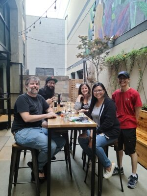

California celebrated its grand re-opening this week on June 15th, and after 1 year and 3 months of various levels of COVID-19 safety protocols. I've stopped the quarantine counter, and hopefully, it will not be making a return any time soon (or ever)!

The trivia team got back together for the first time. 4 out of 5 ain't bad, and we added a new member this week, Joe, who I'd only met virtually before this. Unfortunately, it will be hard to get the OG crew together now that two of our teammates moved to the greater Austin area. Alas, we finished almost last, as our confidence outweighed our knowledge for the picture round, and we lost a double or nothing. And of course, when we're behind, we become even more reckless with those doubles!

I also got to see some of my friends this past weekend for book club, went to the movies. Yesterday, I even went out to dinner in San Francisco after seeing the Immersive Van Gough exhibit.

It's both totally bizarre and totally normal to be doing these things.

What is everyone looking forward to now that the world is returning to a new normal?
