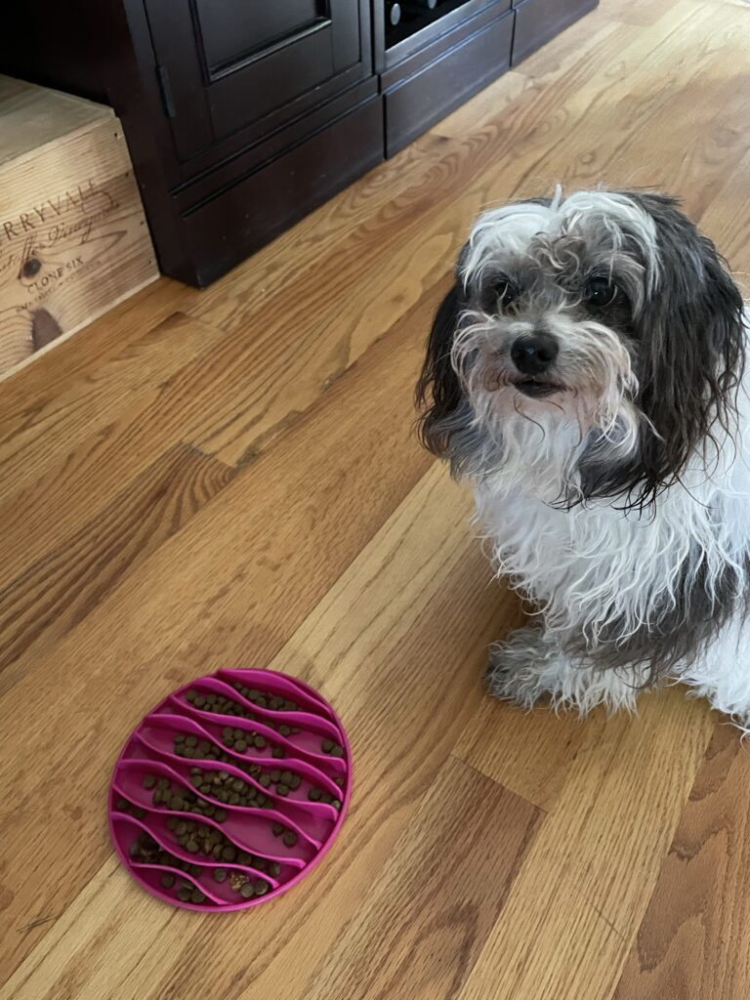

```
Tucked away in a dark corner,Multitudes Of mysteries awaiting discovery inside.In your depthsthere are riches hiddenCast off and forgotten by others.The perfumes waft upon a breeze,Scents of coffee, bark, and meat,Maddening my senses and compelling action.Oh, trash can,Open to my desires, spill your earthly treasures,My Name is Roxy, and I am Dog.
```


