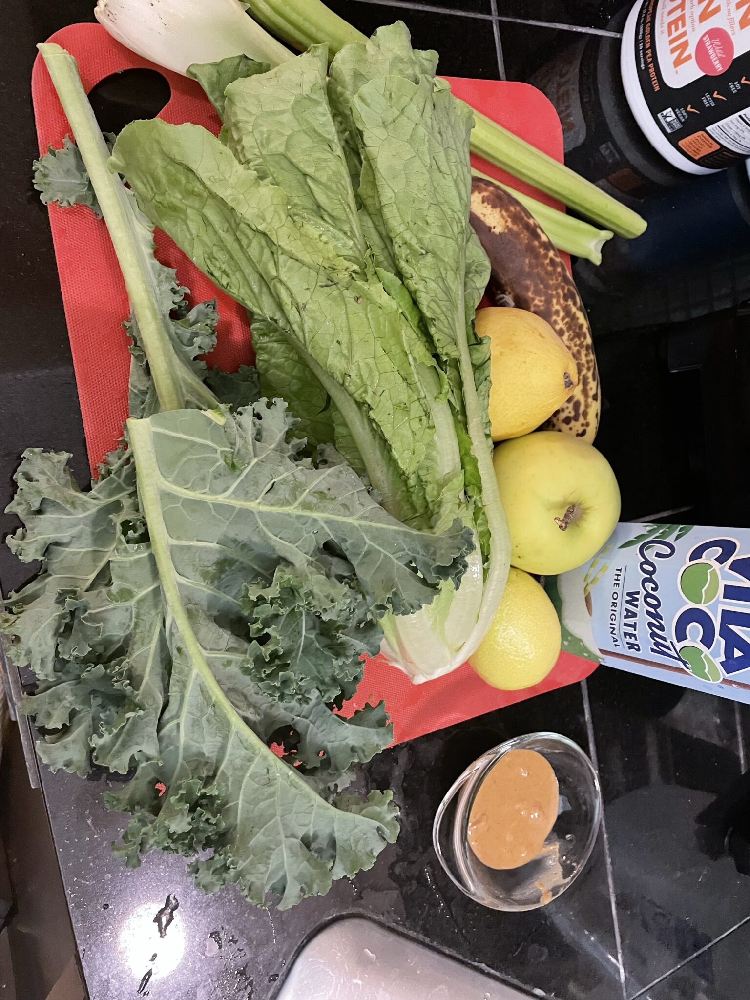
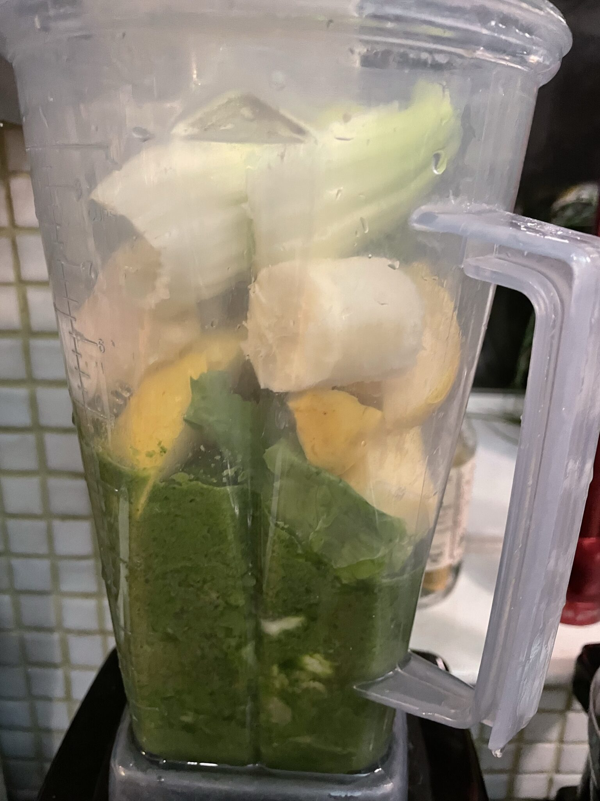
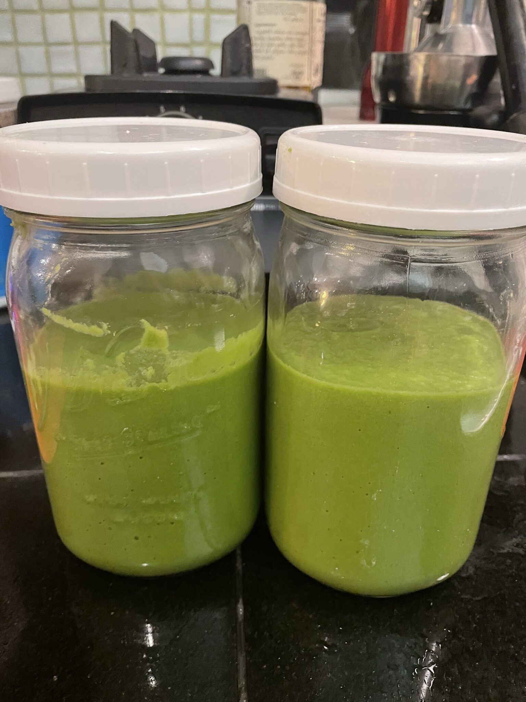

I’m trying (again) to cultivate a habit of a healthy breakfast. This week, I’ve been making a modified version of Reese’s green smoothie.

I’m using only 1 head of romaine, and I swapped the spinach for kale, plus peanut butter, celery, and protein powder. Next batch, I am going to cut back on the lemon as the acidity is not sitting well in the morning.

- 
- 
- 
