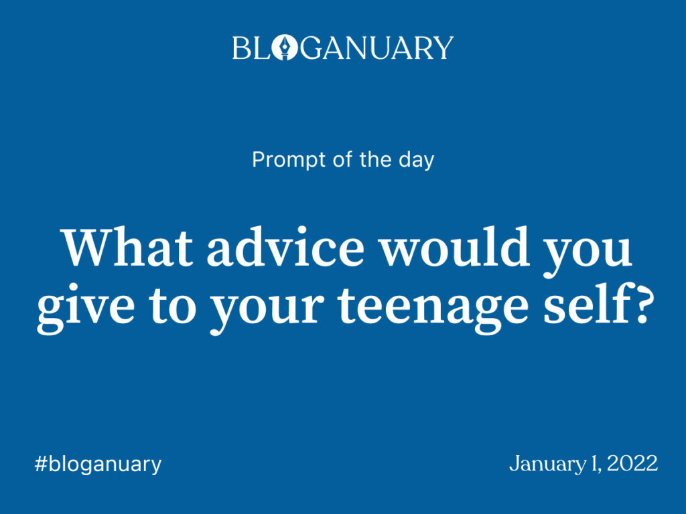
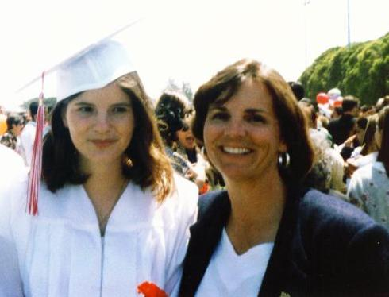

This January, I'm participating in a blogging challenge called #bloganuary, put on by WordPress. I'm excited to try this out; while I loved the blogging challenge I did last year during quarantine, having to come up with my own, original ideas every day was difficult.

For this challenge, WordPress will publish a daily writing prompt. Here's today's prompt:



```
Dear Me,

This isn't what life is like. I know high school sucks, and you're pretty miserable. I don't blame you. If the popular coming-of-age movies are to be believed, this isn't an isolated feeling. Even if sometimes you are feeling isolated, like you're the only one being treated this way, trust me when I say it isn't so.

It may not seem like it, but it will get better. And, as trite as this may sound, you've since learned that it's not nearly as bad as it could have been. We grew up with a lot of privilege, and we still have a lot of privilege in our life, we should be grateful for that. We've always had a warm, safe bed, and food on the table, that's not the case for everyone.

What advice do I have for you? Well, my life has turned out pretty great, so you did well. Thanks for getting us to where we are. 

If you'd like to choose a different adventure, roll the dice, and see where that takes us, some ideas:

Don't give up on college so easily. Do what it takes to go to Berkeley, I think you'd really like it there. 

Or apply to study abroad, that might be a fun adventure. We could go to Spain or Argentina and finally make use of our Spanish and become fluent.

And if you don't do these things, that's ok. By the way, t's ok to make mistakes! What's important is approaching life with a growth mindset, and using these opportunities to learn and do better in the future. It took me a really long time to learn that, I used to run away from anything challenging (I'm looking at you, Engineering Statistics). If you can be inspired by challenges and run towards them, instead of away, you might be surprised at what can happen. It's normal to be scared, that's just part of life. Being brave is doing the things inspite of your fears. "Have courage and be kind" is a motto to live by.

This is perhaps one of the greatest things I've learned, along with knowing that your thoughts are not your identify, and everything you think about yourself is not true.

Oh, one last thing — if you find CompSci is not your thing, try taking a  Philosophy class.
```

<figure>



<figcaption>

high school graduation!

</figcaption>

</figure>
