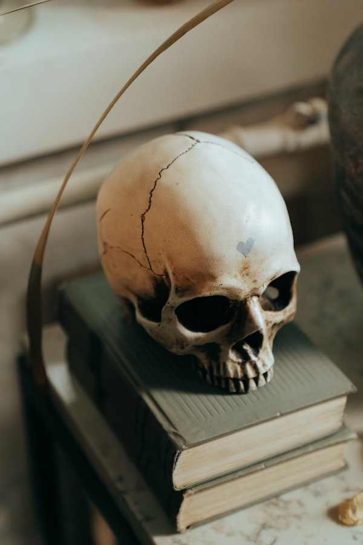

Once again, a year is coming to its conclusion. And once again, it's been a hell of a year. Last year, I read over 100 books, and close to 28k pages. Strangely, this was not very many more pages than the previous year, when I read 82 books. Clearly, more books != more pages. This year, I read "only" 66 book, around 17k pages. Regardless, that's a lot of reading!

Here's this year's list of the most memorable books I read in 2021. As usual, not all of these books were published in 2021, I just happened to read them this year. Some might call it a "best of" list, these are certainly my favorites and highest-rated reads of the year.

## Memorable Fiction Reads

The books in this list are all very different from each other and appeal to me for different reasons.

- _The Invisible Life of Addie LaRue_ - a fantastical take on life, legacy, and what it means to be forgotten.

- _A Court of Silver Flames_ - I love, love, love all the Court of Thorn and Roses books, and this one is no except. Nesta's story needed to be told.

- _The Last House on Needless Street_ - this was a very entertaining mystery/thriller with some unexpected plot twists!

- _The Light of All That Falls_ - the long awaited conclusion to the Licanius Trilogy. A very fitting end, and one of my all time favorite epic fantasy series.

- _The House in the Cerulean Sea_ - the review says it all, this book is what I needed to read this year.

- _Aristotle and Dante Discover the Secrets of the Universe_ - another great read, even better in audio form with Lin Manuel Miranda narrating.

## Memorable Non-fiction Reads

- _Team Topologies_ - this was an eye-opening look at why how you organize your teams really matters, and what's at stake,.,

- _Think Again_ - this book certainly changed my outlook, and contributed to my decision to swtich jobs after being with the same company for 15 years.

- _Breath_ - one of my four pillars of health — if you're not breathing, you're dead, right?

<figure>

<figcaption>

Me, trying to get through my TBR list.  
  
Photo by **cottonbro** from **Pexels**.

</figcaption>

</figure>
