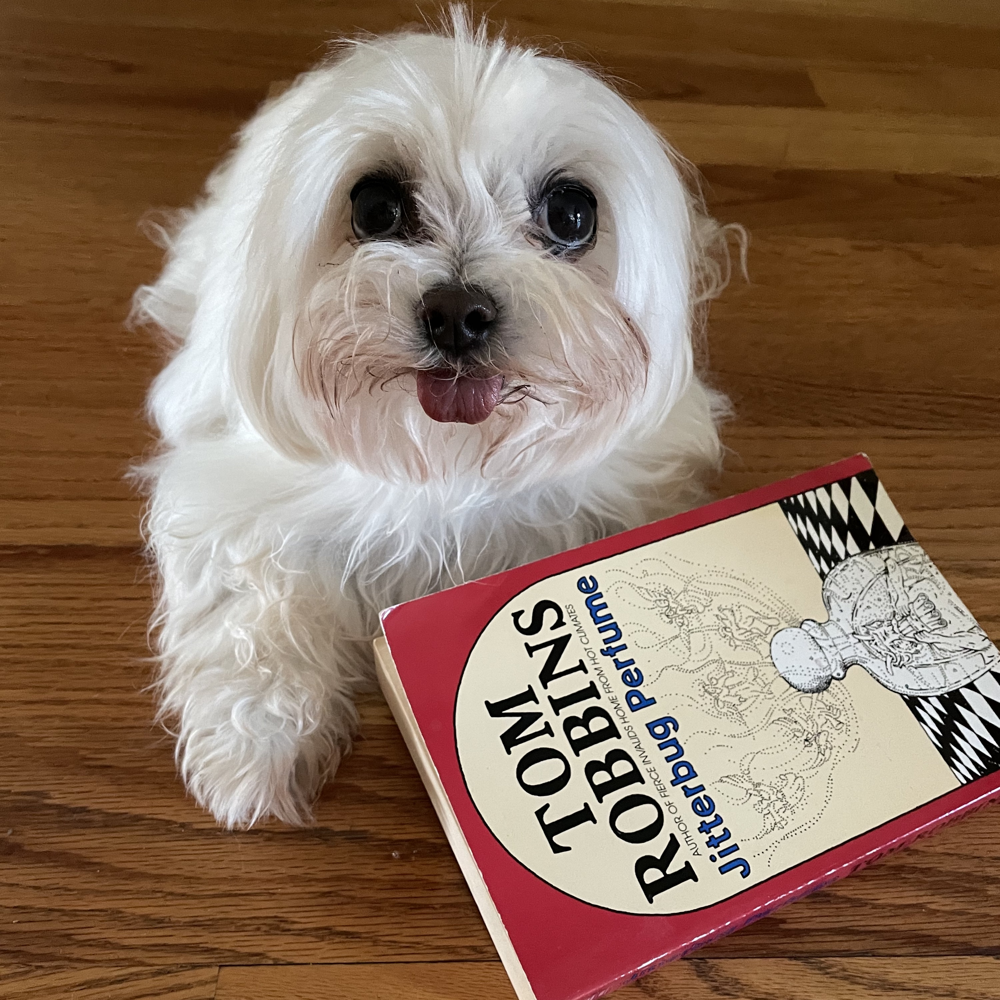

_#Bloganuary day 4: write about your favorite childhood toy._

Looking back, some of my favorite toys growing up were My Little Ponies, Cabbage Patch Kids, Popples...

However, if I had to pick a single toy, then hands down, I'd have to pick the NES. While I did love my Atari 2600, I'm a sucker for a good Mario game and would play for hours and hours on end.

I was kind of a nerdy kid. I preferred playing video games or curling up with a dog or cat while reading a book over just about everything else.

Hmm. Not much has changed.

<figure>

<figcaption>

Indy with one of my favorite books, _Jitterbug Perfume_ by Tom Robbins.

</figcaption>

</figure>
