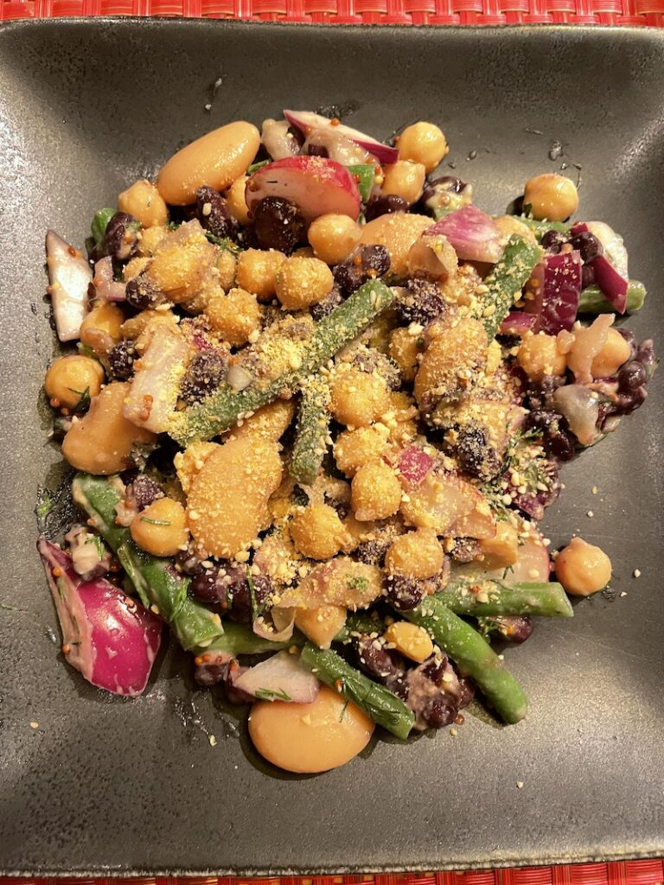

I've been suffering from acid reflux, chronic sinus issues, and IBS. A few years ago, a doctor recommended an elimination diet. Well, the acid reflux and the IBS got a LOT better during the elimination phase.

Then I did a really shitty job of adding things back in and went crazy with pizza and wine. As far as I can tell, the IBS symptoms are most likely caused by corn, dairy, and/or not having enough fiber. When I was doing the elimination part, I ate an apple every day, and lots of lentils.

So, here I am trying again to get to the bottom of this and find the mysterious thing that's making me sick. At the very least, this is a good opportunity to kick the caffeine habit. My doctor thinks that's the most likely cause of my acid reflux issues, which might also be causing the sinus issues.

This time around I am doing a much shorter list. For three weeks:

- No gluten
- No dairy
- No corn (it's hiding in everything, this one is hard)
- No soy (also hiding in a lot of things)
- No eggs (easy, pretty much don't eat them already)
- No caffeine
- No fake sugars (like sorbitol)

This time I am allowing alcohol, sugar, nightshades, and refined oils. Hopefully, I will still get some results. Once the three weeks are up, the key is to add things back one at a time and monitor for any symptoms.

Since I can't order a pizza, tonight I made a salad. Roxy really enjoyed getting some scraps of green beans. I swear, she'll eat anything if she thinks it's people or cat food.

## Lemony Dijon Dill Bean Salad

- 1 can butter beans
- 1 can black beans
- 1 can chickpeas
- 1 to 2 cups green beans
- 1/2 red onion (diced)
- 1 cup sliced radishes
- 1-2 TBSP Old Style (grainy) mustard
- 1-2 TBSP Dijon mustard
- juice from 1 lemon (or 2 TBSP)
- 3 cloves garlic (minced)
- 2 TBSP dill (chopped)

This salad is really easy to make. If you don't want to do ANY cooking, leave out the green beans.

- Trim and cut the green beans into bite-size pieces. Blanch by boiling for 2 minutes, then transfer immediately to a bowl of ice water until cool. Pat dry and then place in a bowl.
- Drain and rinse the canned beans, and place them into your bowl.
- Add the onions and radishes.
- Mix the mustard, lemon juice, garlic, and dill. Toss w/ salad or serve on the side.

You can top this with some vegan cheese, l went with Minimalist Baker's vegan parm.

Not a fan of red onions or radishes? Try celery or carrots instead, to keep the crunch.

Today's #Bloganuary prompt is to write about something mysterious.
