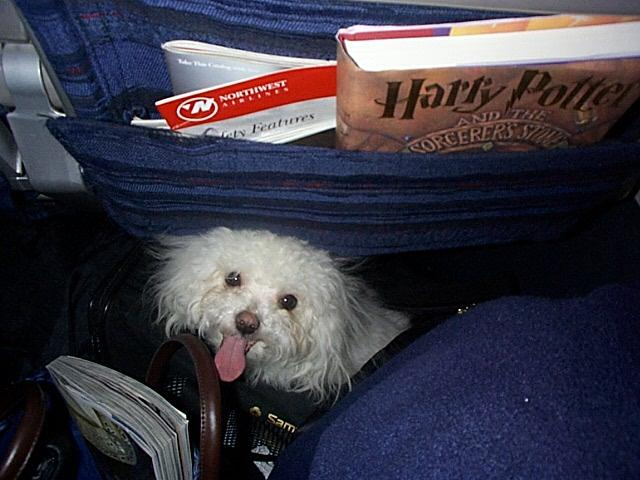
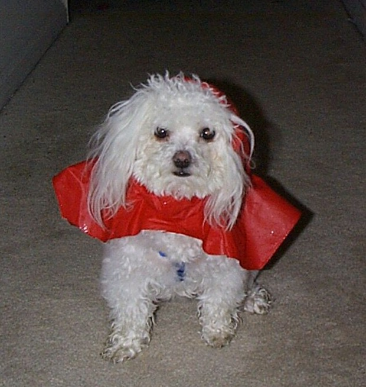
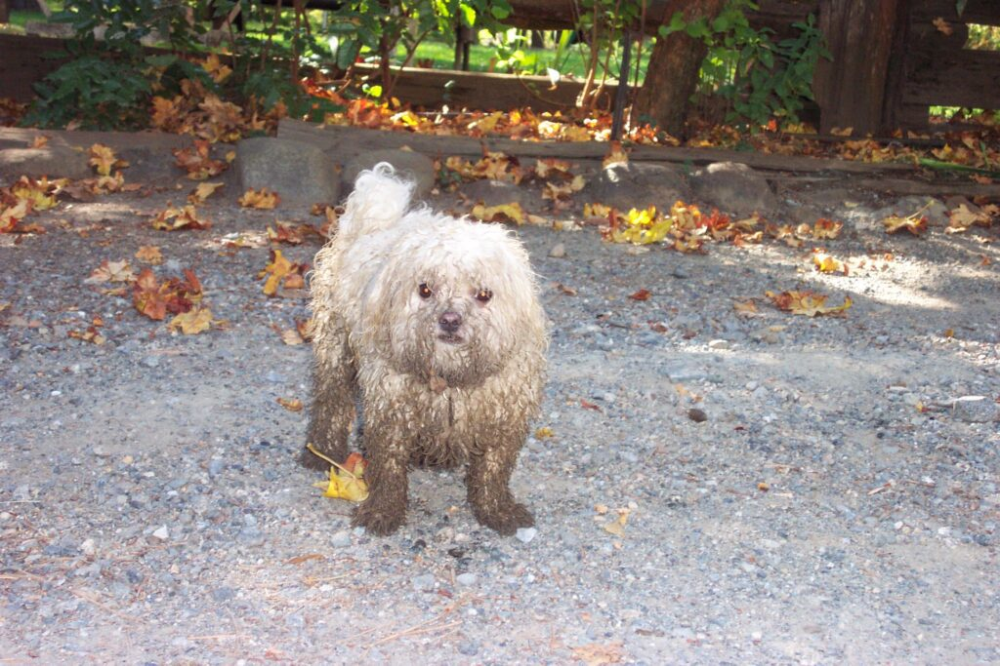

Today #Bloganuary asks about my favorite photo. As soon as I saw the prompt, I knew this would be both difficult and easy at the same time.

I take a **lot** of photos. Mostly just throw away photos, but there's a lot. Photos of food, photos of pets, flowers, whatever I want to remember.

And that really is the essence. For me, photos are all about capturing memories. So asking for my favorite photo is like asking for my favorite memory.

I can't pick just one. However, you'll see there's a theme.

These three photos are all of Comet. From left to right:

Comet under my seat on an airplane. This was our first trip home together, flying from Baltimore to San Francisco. I was reading Harry Potter for the first time!

Comet with his red raincoat. Oh boy, he hated that, and he wouldn't pee outside with it on. Sort of defeated the point!

Comet covered in mud. My other dog Bailey had been playing in the creek at my dad's house, and as he would dart out of the water, he would run a bit with Comet. Comet never got in the water, just at the edge, but he ended up like this, while Bailey came out fairly clean.

Comet is the origin story for this blog and its name, Adventures of Cometgrrl. It used to be Adventures of Cometgrrl and Comet. 🥲

I don't know that I loved Comet any more than Roxy or Indy or Dexter. I have tons of photos of them too! However, the photos and memories of the living are not quite as precious as for those who are gone.

It's been over 10 years, and I still can't watch this video without crying.

https://cometgrrl.com/wp-content/uploads/2022/01/comet.mp4
