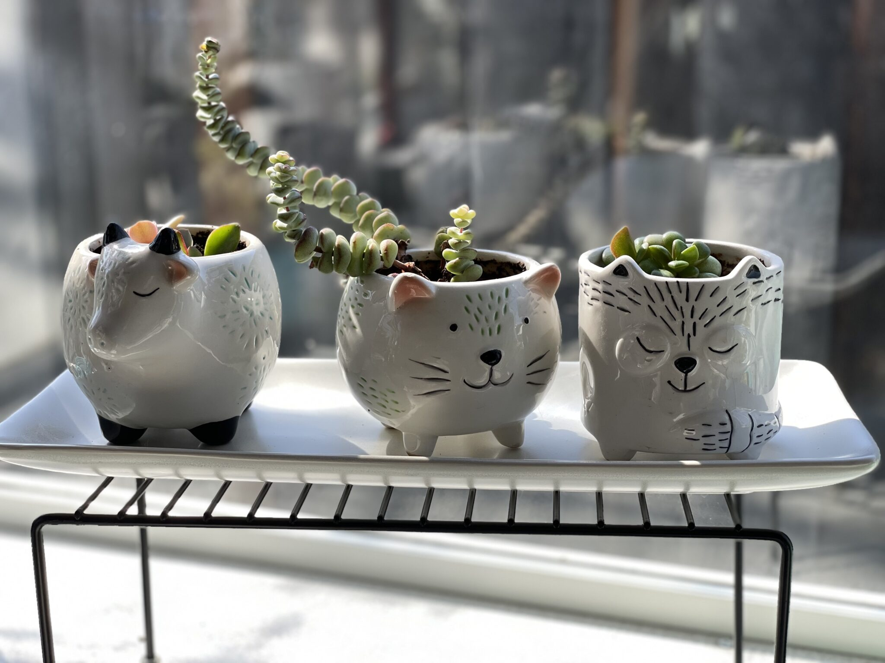
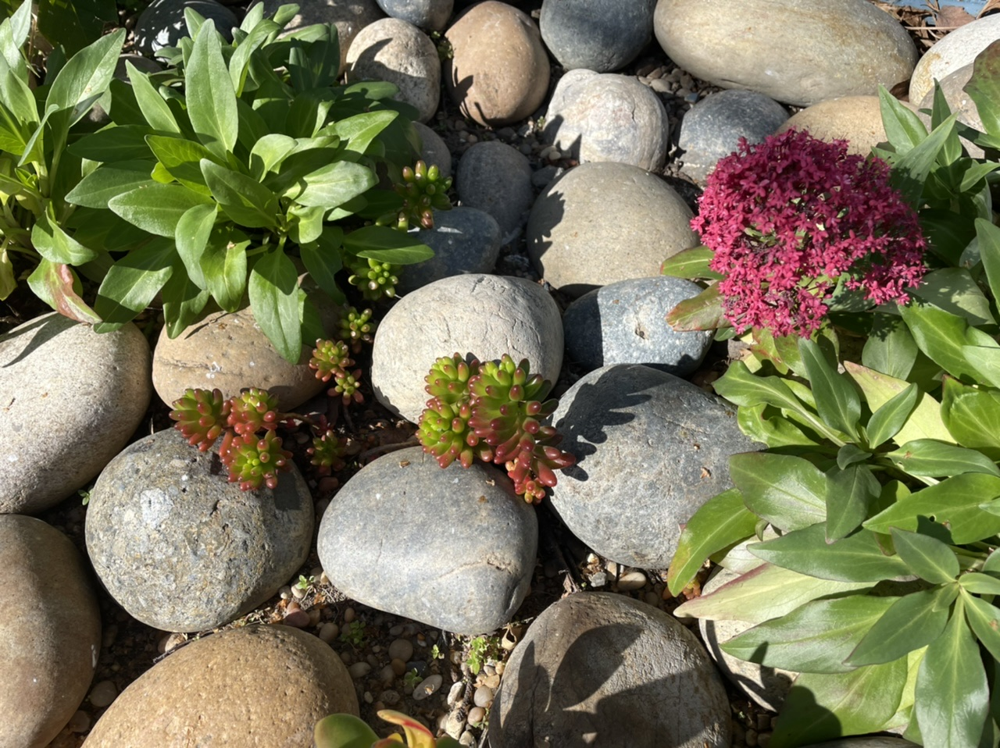

And it feels like summer! It’s been a whopping 80 °F here this week.

The puppies love this beautiful weather, and they’ve been keeping me company in the yard. They also enjoy cuddling with me in the hammock while I’m reading.

It will go back to being winter soon. Of course, here in California winter is never very cold anyway, so I can’t really complain.

<figure>

<figcaption>

Succulents and plants from around the house.

</figcaption>

</figure>
