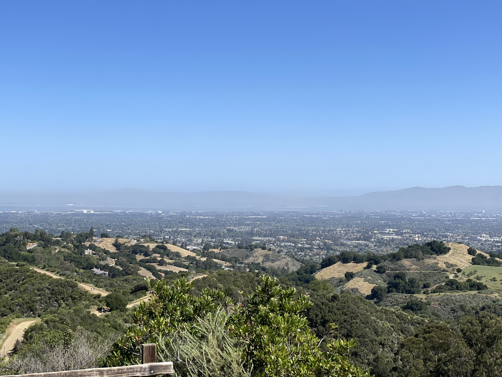

I haven't been hiking much lately, and I wanted to try out my hiking boots before going to Canada next month. We'll be doing some hiking at Banff National Park and I need to decide whether to pack them or not.

I decided to hike up to Maisie's Peak. In the past, I have hiked at Fremont Older Open Space Preserve, but I have never been to this part. AllTrails suggested starting from Stevens Creek County Park, and crossing over into Fremont Older, so that's what I did. The hike is listed as a moderate intensity hike of 2.5 miles, taking approximately 1 hour and 20 minutes to complete.

<figure>

<figcaption>

The way up. Most of the trails on the Stevens Creek County Park side of my hike looked similar to this. Narrow, shady, in some places rocky, and there were a lot of steep areas, with some switch backs.

</figcaption>

</figure>

I was a little skeptical of the suggested parking, with AllTrails giving me coordinates on the map, rather than an address or a marked place. It did indeed turn out to be a real parking area, unfortunately it was closed.

Thankfully, there's a lot of trailheads in the area, and I had just passed an open parking location. I figured even if I had to pick a new route or destination for my hike, at least I could still hike from there. Luckily, the trail I ended up at led easily to my original intended route, and only added about a half mile to the total hike.

<figure>

<figcaption>

This is where I crossed into Fremont Older Open Space Preserve. Over here, the trails are wide, with fewer switch backs, and shade is rare.

</figcaption>

</figure>

In the end, the hike was approximately 3 miles, and it took me 50 minutes up and 30 minutes down, so the timing of 1 hour and 20 minutes was spot on, despite the slight detour.

There's a lovely view at the top, and a nice wide lookout area. Too bad there's no place to sit and no shade.

<figure>

<figcaption>

View from Maisie's Peak

</figcaption>

</figure>

All in all, the hiking boots worked out pretty well. I may change the insoles, as right now I have in some custom insoles with arch support. They are a bit different from the ones I normally use, and hurt my feet a bit towards the end of this hike.

Also, I felt _very_ out of shape on the uphill parts of this hike. I really need to get out and get active again! Anyone local wanna go for a hike with me?

<figure>

<figure>

<figcaption>

On the way to Maisie's Peak

</figcaption>

</figure>

<figure>

<figcaption>

More of the view at Maisie's Peak

</figcaption>

</figure>

<figure>

<figcaption>

Me, tired and heading back to the car

</figcaption>

</figure>

</figure>
