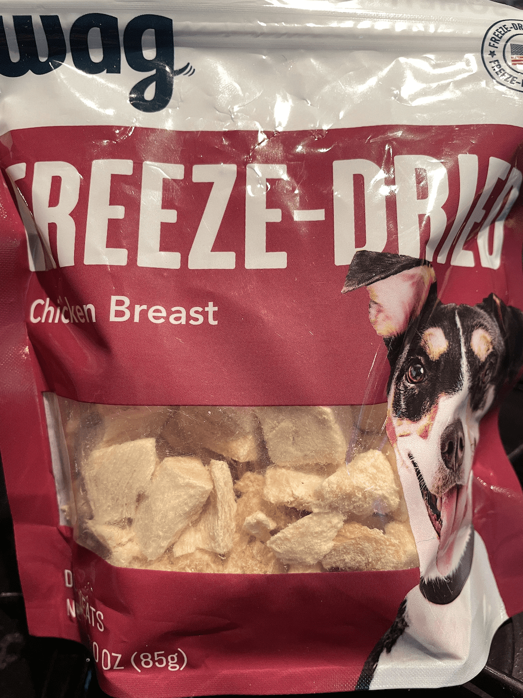
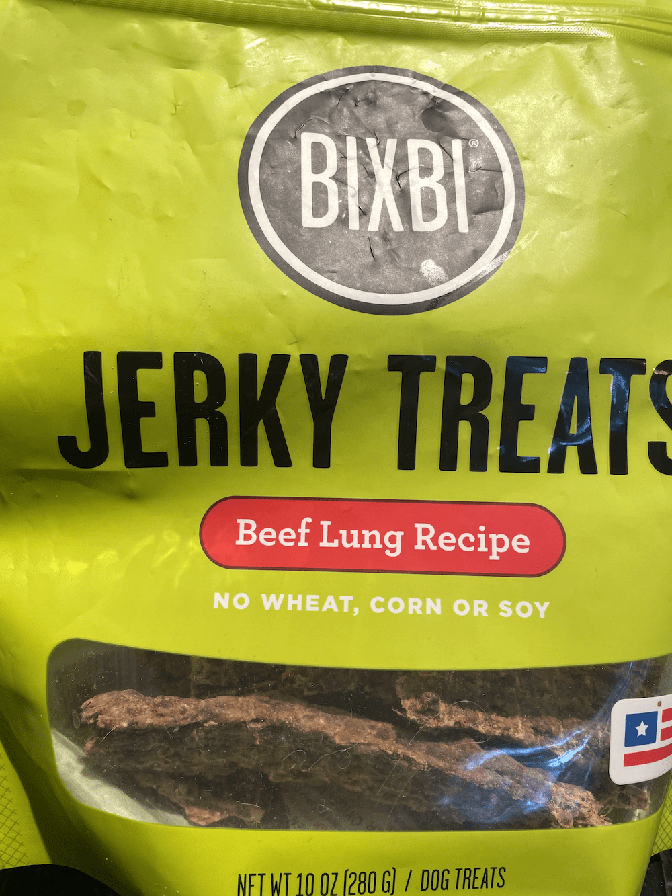
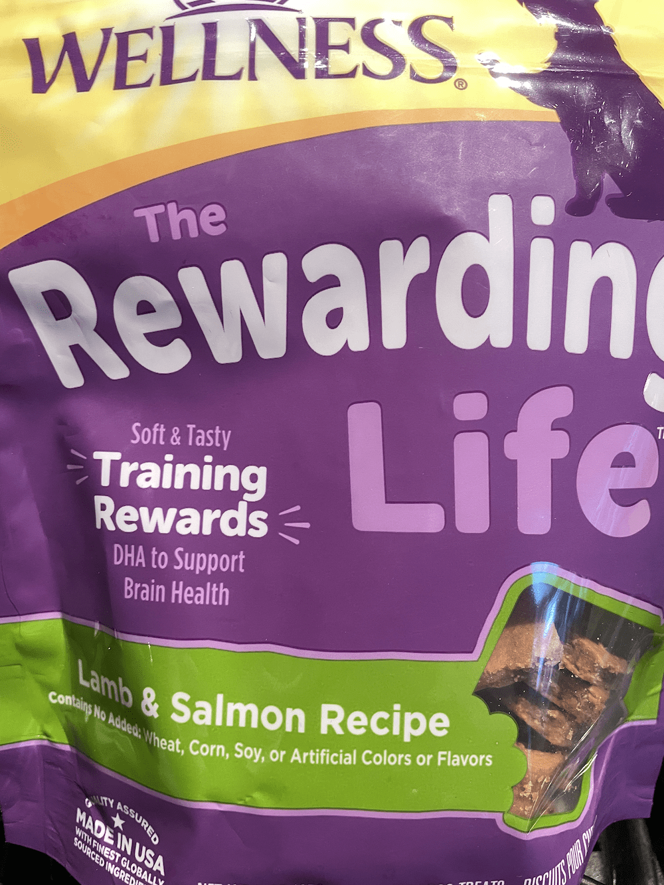
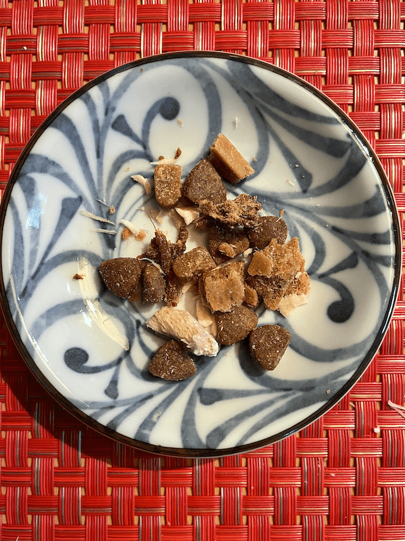
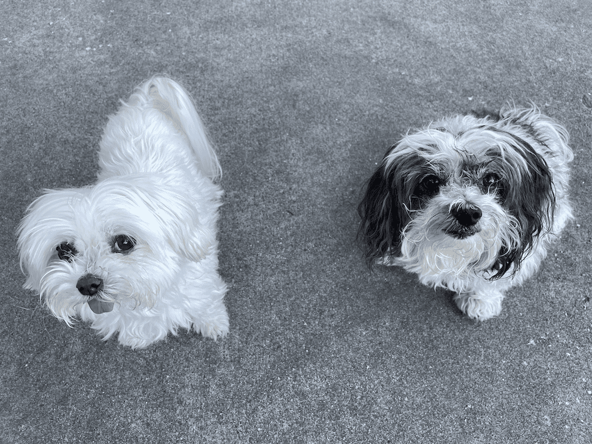

Someone recently shared an article with me about creating a trail mix for your dog. Prior to this, I had never given much thought to planning or curating a snack mix for my pups. I usually grab something and give them a treat from whatever's handy.

The article mentioned that the variable reward levels presented by the various treats helped with training and engagement. This all sounded great! Previously, I had relied on varying the reward level by using more (or less) of certain treats.

Now the only question was, what would I put into _Roxy and Indy's Custom Blend Miracle Reward Puppy Snack Mix_?

The author of the article uses cheerios as their low-value treat base. Ugh. That's a lot of sugar! Most dogs don't normally eat anything sweet (except when they sneak some bites of things they shouldn't be eating). I also wonder how many people feed their dogs grain-free food and then treat them with Cheerios or some other nonsense. I'm not opposed to grains, and I don't feed my dogs grain-free food, but I still think Cheerios are not a great idea.

I decided the simplest ingredient to use as a base is plain old dog kibble. We often do training sessions at mealtimes to re-enforce some of their tricks; Indy and Roxy do tricks for treats using kibble.

For the high-value treats, I went with a mixture. The freeze-dried chicken they love always has crumbs and flakes left at the bottom that are impossible to feed. These went into the mixture since they stick to the other treats and raise the value of everything!

I then added some chunks of the freeze dried chicken, and pieces of jerky. To round out the middle range, I put in small pieces of two types of soft treats: peanut butter treats, and lamb and salmon treats.

The result? Roxy and Indy are both very pleased and eager to get rewards. At first, when they'd get a good treat, I'd call that a jackpot, which evolved into calling the whole mixture/container the Snackpot™.

<figure>

<figcaption>

Indy and Roxy waiting to see if they've won the Snackpot™.

</figcaption>

</figure>
