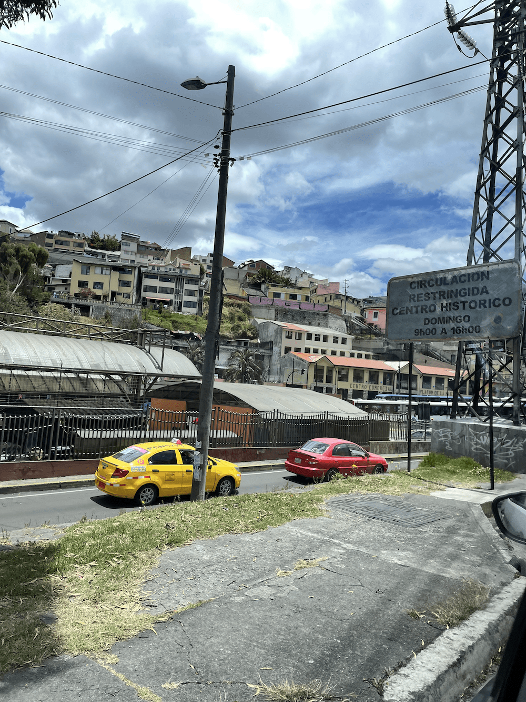
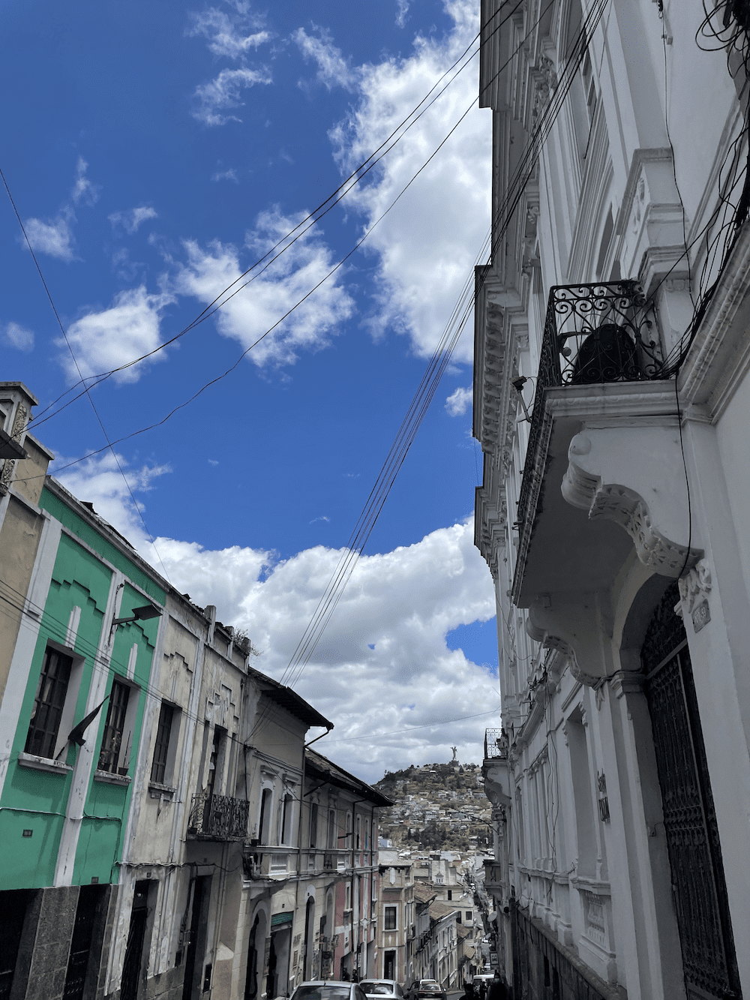
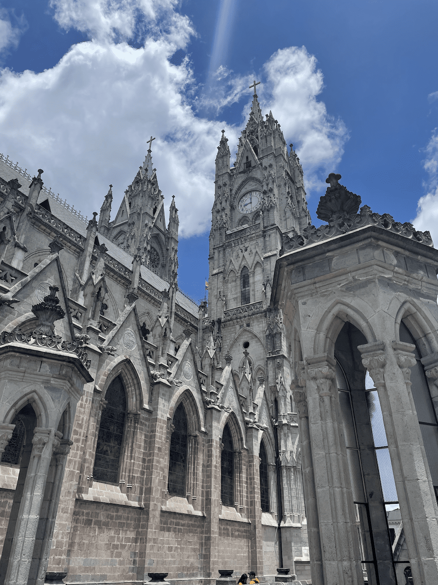
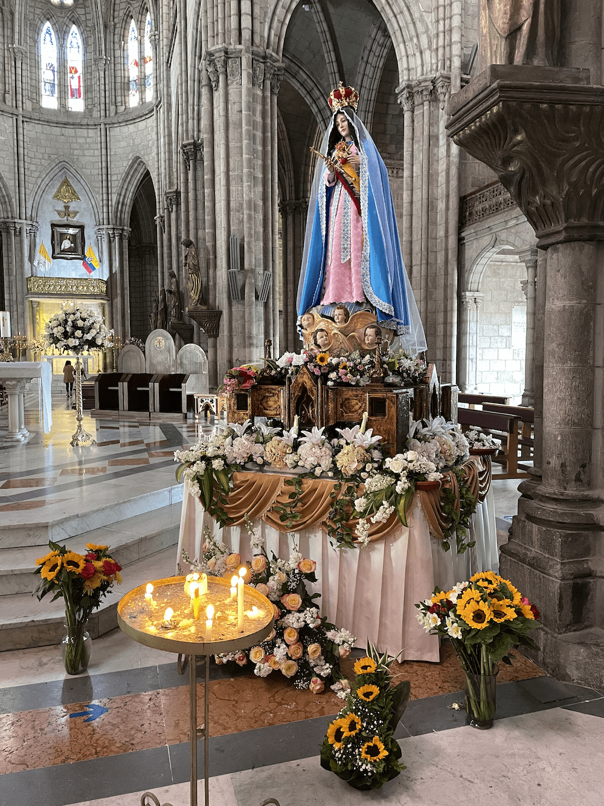
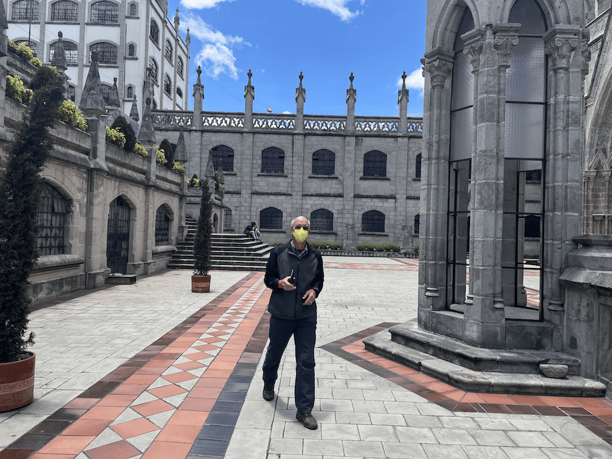
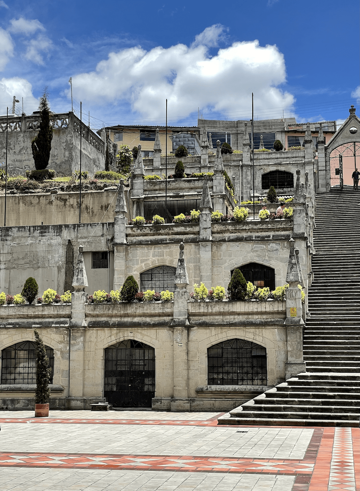
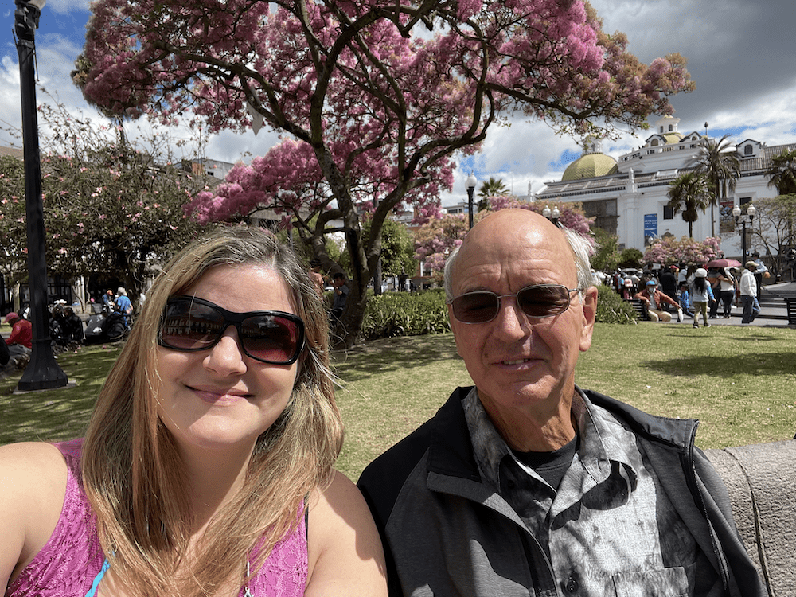
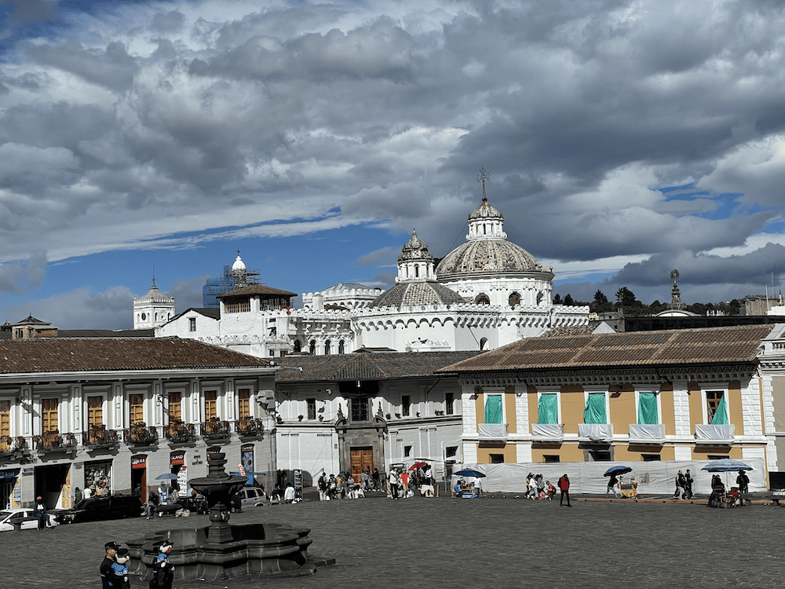
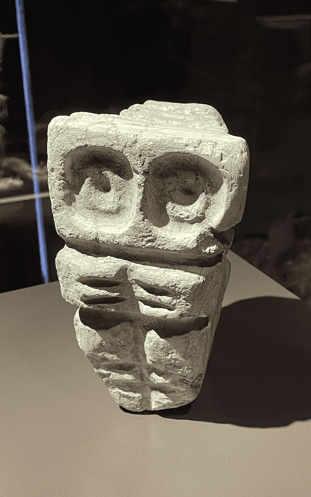
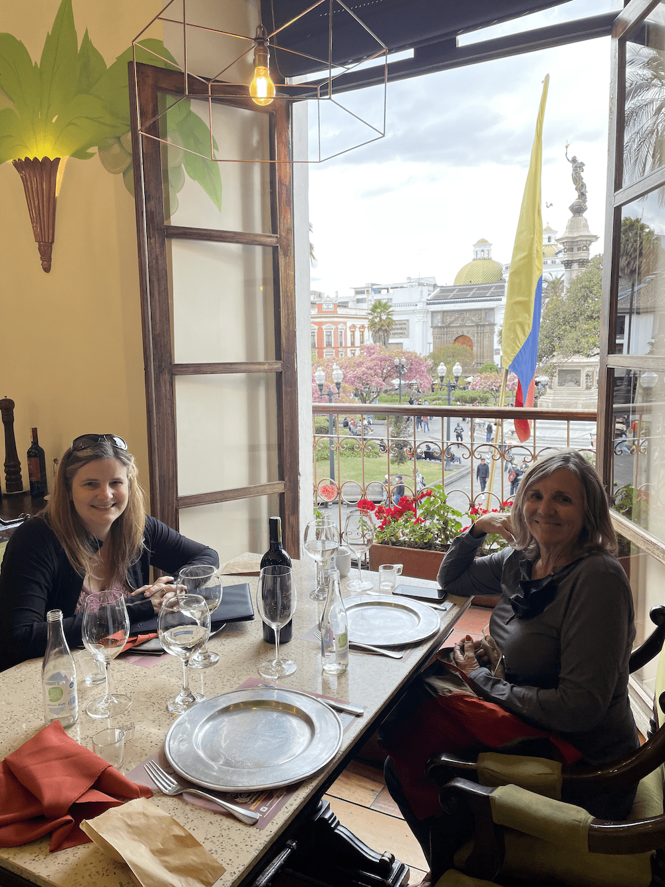

Hoy, pasamos el dia en Quito. Hablé español con muchas personas diferentes y aprendí que necesito practicar más el español.

We did a lot of walking today, and visited some churches and museums.

<figure>

<figure>

<figcaption>

Around Quito

</figcaption>

</figure>

<figure>

<figcaption>

Walking in Quito

</figcaption>

</figure>

</figure>

First, we went to the Basílica del Voto Nacional.

<figure>

<figure>

<figcaption>

Basílica del Voto Nacional

</figcaption>

</figure>

<figure>

<figcaption>

Inside Basílica del Voto Nacional

</figcaption>

</figure>

<figure>

<figcaption>

Behind Basílica del Voto Nacional

</figcaption>

</figure>

<figure>

<figcaption>

Behind Basílica del Voto Nacional

</figcaption>

</figure>

</figure>

And then we walked to Plaza de la Independencia, Iglesia La Compañía (which was hard to find and they didn't allow photos), La Iglesia de San Francisco (also no photos allowed), and to Casa Del Alabado, a museum of Pre-Columbian art.

<figure>

<figure>

<figcaption>

Plaza de la Independencia

</figcaption>

</figure>

<figure>

<figcaption>

Plaza de San Francisco

</figcaption>

</figure>

<figure>

<figcaption>

Art at Casa del Alabado

</figcaption>

</figure>

</figure>

We finished off our day with wine and dinner at La Vid, over looking Plaza de la Independencia.

<figure>

<figcaption>

Dinner at La Vid

</figcaption>

</figure>

Tomorrow, we're off for the rest of our adventure!
