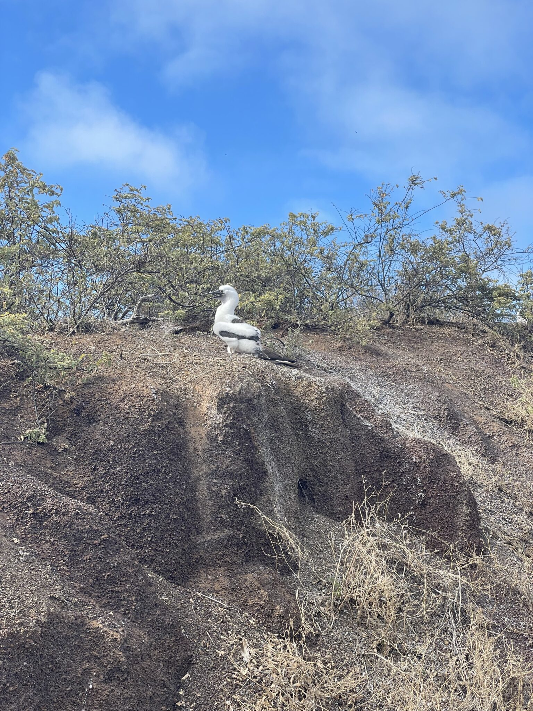

Today, we spent the day at Isla Floreana.

We started with a hike at Punta Cormorant.

<figure>

<figure>

<figcaption>

The beach at Punta Cormorant.

</figcaption>

</figure>

<figure>

<figcaption>

Cone snail. Used by the mob to murder people, undetected.

</figcaption>

</figure>

<figure>

<figcaption>

A baby blue-footed booby.

</figcaption>

</figure>

<figure>

<figcaption>

Flamingos in the lagoon at Punt Cormorant.

</figcaption>

</figure>

</figure>

After our hike, we went snorkeling. I wish I had an underwater camera! A giant alpha male sea lion swam right next to me. He was so close I could almost touch him.

This afternoon we are kayaking and visiting Post Office Bay, also on Isla Floreana.
