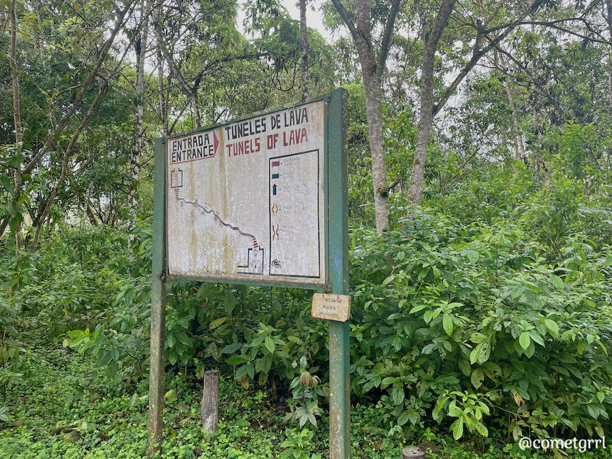

On Thursday, we disembarked on Santa Cruz Island. While here, we walked in a lava tube, and went to a tortoise habitat.

We didn't go all the way through the lava tube, as parts of it are quite low/narrow and muddy. However, it's estimated at 1km in length, which is quite long!

After exploring the lava tube, we went to Rancho Primicias, the Giant Tortoise Reserve.

<figure>

<figure>

<figcaption>

It's hard to tell how huge these are without a reference.

</figcaption>

</figure>

<figure>

<figcaption>

Random plant.

</figcaption>

</figure>

<figure>

<figcaption>

Tortoise selfie! This is was the first day I was sick on the trip, so pardon my expression.

</figcaption>

</figure>

</figure>

<figure>

<figcaption>

This guy is certainly in a hurry!

</figcaption>

</figure>
