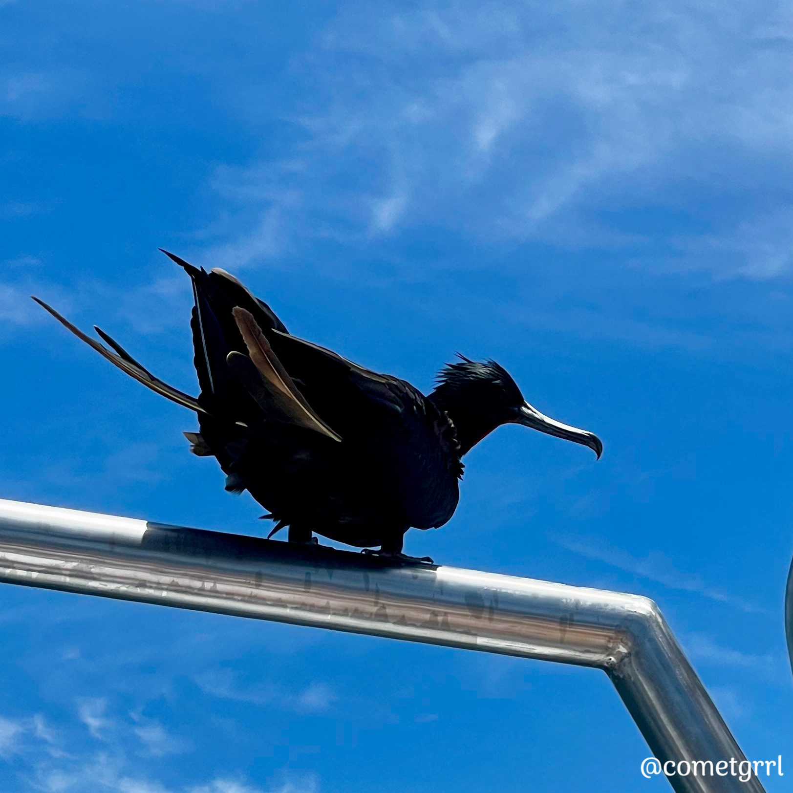
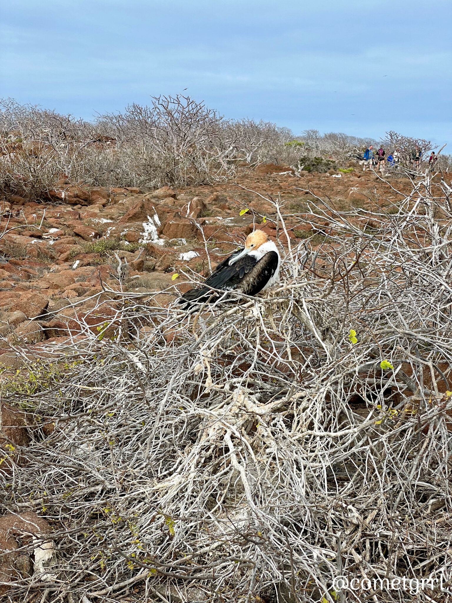
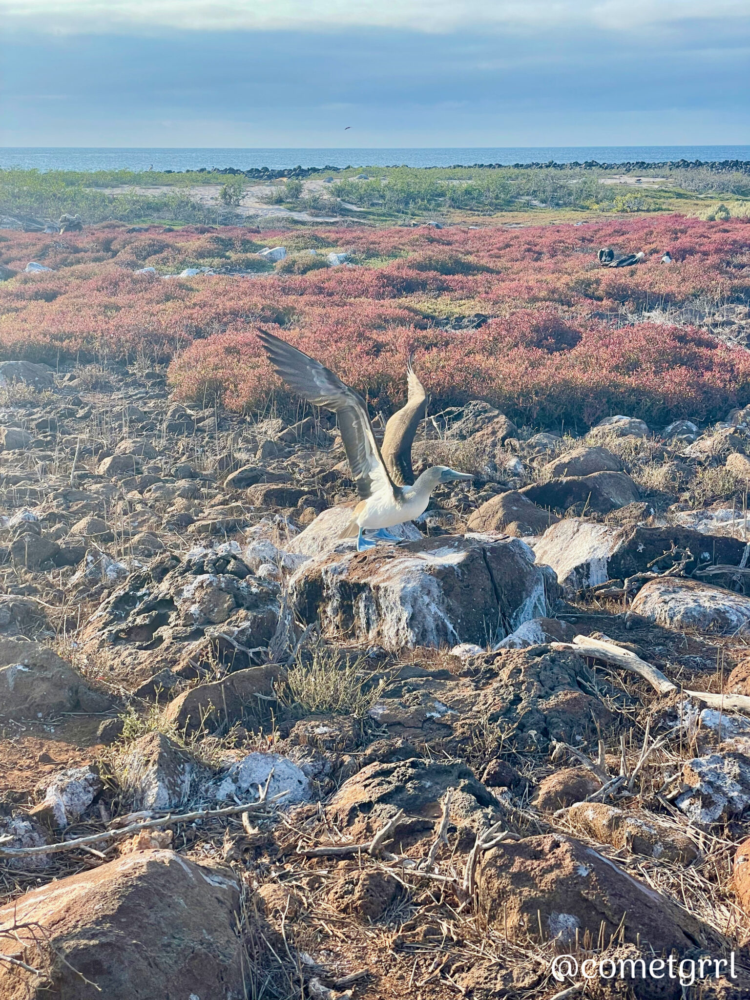
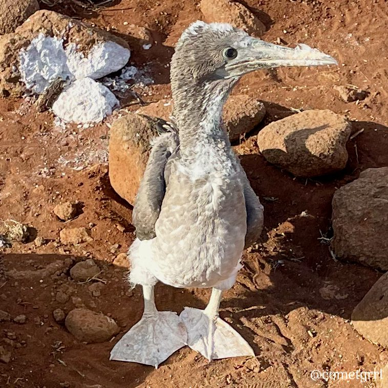
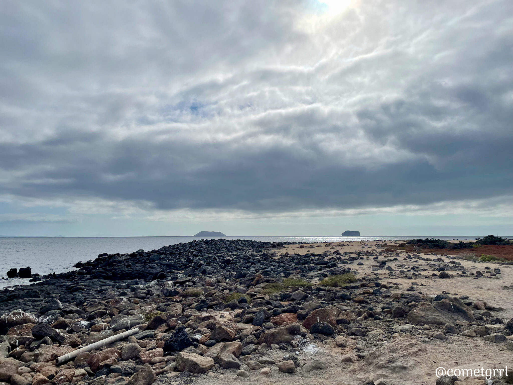
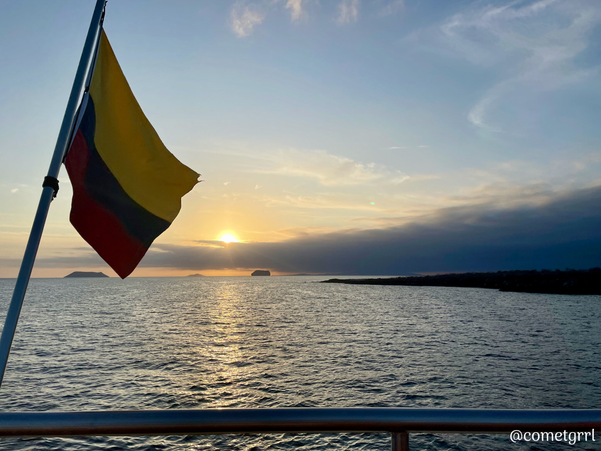

Our second stop on Saturday, Isla Seymour Norte is home to the Frigatebirds. Here we saw the Great Frigatebirds, the Magnificent Frigatebirds, as well as other birds.

The Frigatebirds were a constant companion to our ship during the trip. Frigatebirds cannot swim or land on water, but spend up to a month at sea (flying). They even sleep while they are flying! They enjoy riding in the air currents above ships and occasionally take a perch.

<figure>

<figcaption>

Frigatebird perched on top of our ship.

</figcaption>

</figure>

There really were a LOT of birds to see on this island. There were many displaying male Frigate birds, and females circling looking for mates.

<figure>

<figure>

<figcaption>

Baby Frigatebird

</figcaption>

</figure>

<figure>

<figcaption>

Juvenile Blue-footed Booby

</figcaption>

</figure>

<figure>

<figcaption>

Displaying (for mating) male Frigatebird. The red inflatable bit can get as large as a basketball!

</figcaption>

</figure>

<figure>

<figcaption>

Baby Blue-footed Booby

</figcaption>

</figure>

</figure>

<figure>

<figcaption>

Blue-footed Booby

</figcaption>

</figure>

<figure>

<figcaption>

Displaying male Frigatebird.

</figcaption>

</figure>

<figure>

<figure>

<figcaption>

This island felt very desolate, despite all the birds.

</figcaption>

</figure>

<figure>

<figcaption>

Isla Seymour Norte sunset

</figcaption>

</figure>

</figure>
