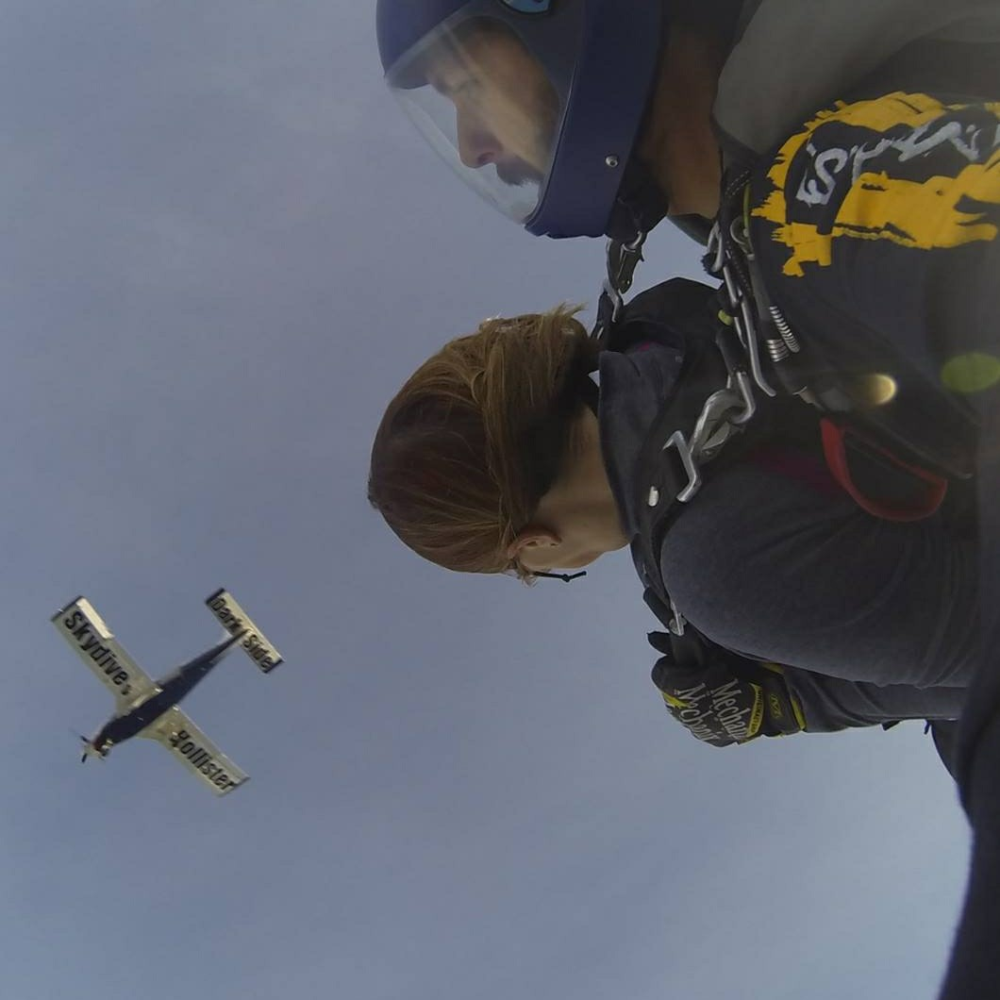

**How are you brave?**

Today's #bloganuary prompt has sent me down a rabbit hole!

First thoughts, how is bravery different from courage? Is bravery being bold with an absence of fear? Does bravery imply physical danger? Why is the only thing I can think of the Cowardly Lion from the Wizard of Oz? The internet has a lot of opinions on these topics. I'm not entirely sure all of this is right, so perhaps I should ignore it.

Do you know what I realized? This rabbit hole, like rabbit holes so often are, is simply a distraction from the uncomfortableness that rises when I try to answer the question.

How am **_I_** brave? How **_am_** I brave? **_How_** am I brave? How am I **_brave?_** Well, changing the question's emphasis is not making it easier to answer. Which leads to "_am I brave?"_

While I would like COURAGE to be one of my core values, it makes me uncomfortable. Does that mean I need to be courageous or brave all the time? What if I fail? And reading my self-talk written out like this, I notice two things. One, there is some imposter syndrome going on here, and two, I see some fixed mindset beliefs jumping out.

Some of the best self-help advice I've read recently can be paraphrased as listening to your self-talk and then rephrasing it as if you were talking to a friend or loved one.

So, instead of beating my self up with negative self-talk, I'm going to think about this as if I were talking to a loved one.

_Some might consider it brave to be posting this and sharing this sort of vulnerability._

_Who cares what the internet thinks is brave?! Choose your own definition and roll with it._

_Of course, you're brave! You do a million brave things every single day. Ok, maybe not every day, but you get my point!_

_A core value of courage could be similar to an intention word, and help serve as a reminder to keep courage in your heart and your life._

<figure>

<figcaption>

I would probably call this reckless more than brave, but it certainly took courage to make it out of the plane.

</figcaption>

</figure>

PS. I'm not sure I've actually answered the question!
