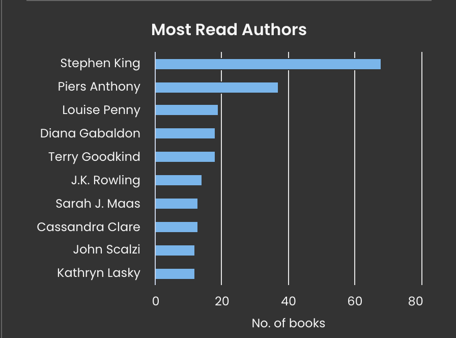

If frequency, or number of books read is any indication, then my favorite author is clearly Stephen King. And, even without counting, if you asked me, that's the answer I'd give you.

I can't say I've loved all of this books. However, I read the entire _Dark Tower_ series twice. I also really enjoyed _The Talisman_, _Misery,_ and many, many others. One of his most recent novels, _Fairy Tale_, is excellent.

Coming in a distant second is Piers Anthony. I read approximately 24 of the _Xanth_ novels. I feel like I read a few more than that, but I think the names might be familiar because I had intended to read them, not because I actually did. _Xanth_ #47 will be published this year, so it looks like I have some catching up to do! I also loved _The Incarnations of Immortality_ series, as well as some of his other, shorter series, although I'm not sure I finished those either.

Third on the list is Louise Penny, with the beloved _Inspector Gamache_ books, followed by Diana Gabaldon, author of the _Outlander_ series, which I adore.

Today's art is Stephen King inspired, `a water color of a single red rose, growing in the middle of a spooky cemetery at night.`

Today's #Bloganuary prompt: **Who is your favorite author and why?**
