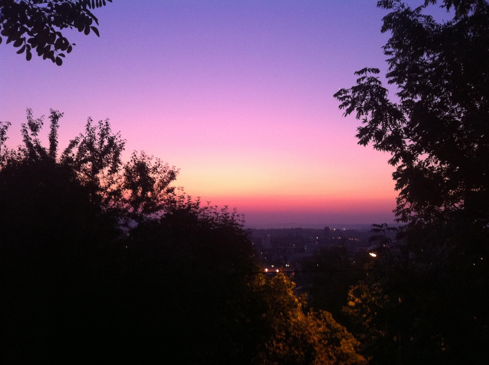
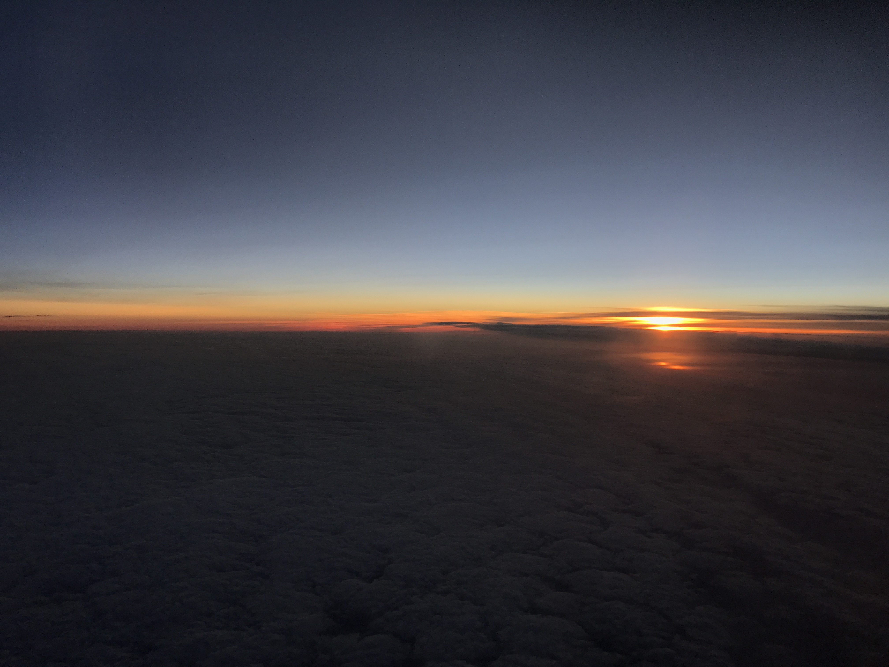
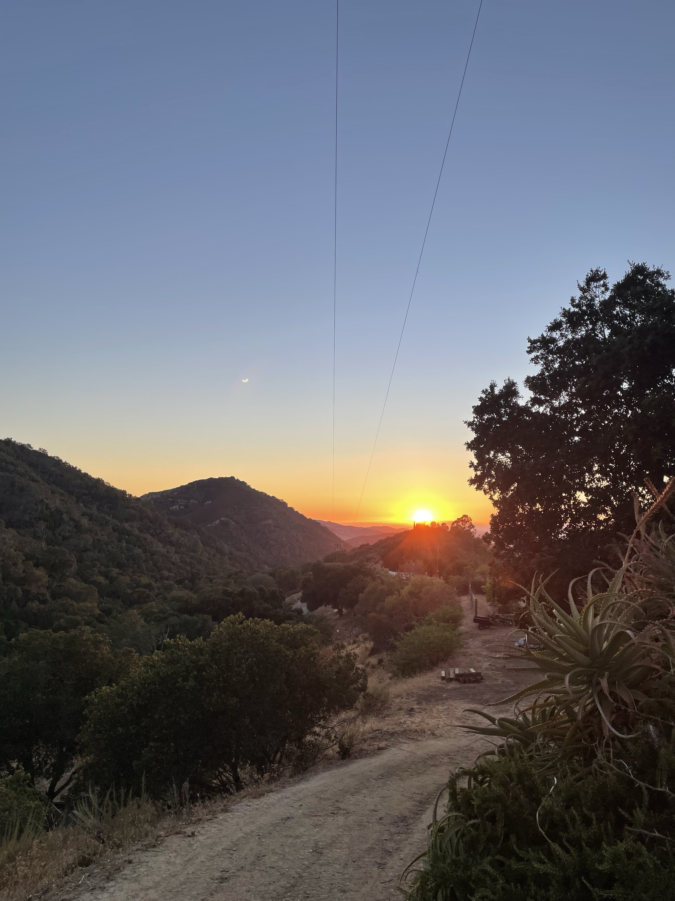
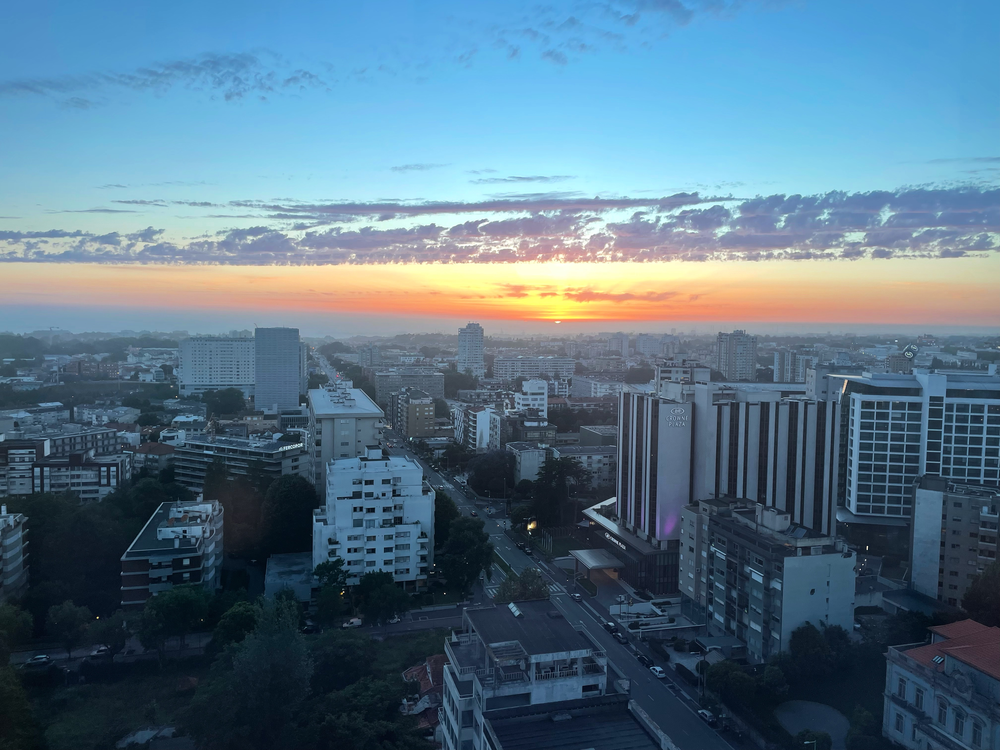
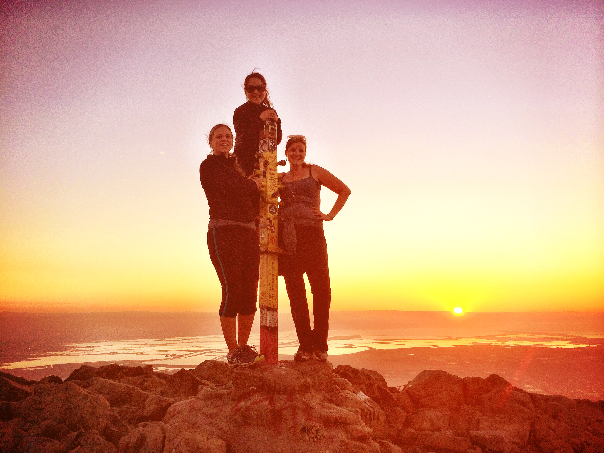

Today is the final day of #Bloganuary.

Today’s prompt: **Where is the best place to watch the sunset near you?**

Since I live in a fairly dense suburban area, I’m not sure there’s a great place near me.

So instead, here are some of my favorite sunset photos. The featured image for this post is from the Galápagos Islands.

<figure>

<figure>

<figcaption>

Cluj-Napoca, Romania

</figcaption>

</figure>

<figure>

<figcaption>

From the airplane window.

</figcaption>

</figure>

<figure>

<figcaption>

San Juan Bautista, California

</figcaption>

</figure>

<figure>

<figcaption>

Porto, Portugal

</figcaption>

</figure>

<figure>

<figcaption>

My neighborhood, San Jose, California

</figcaption>

</figure>

<figure>

<figcaption>

Mission Peak

</figcaption>

</figure>

</figure>
