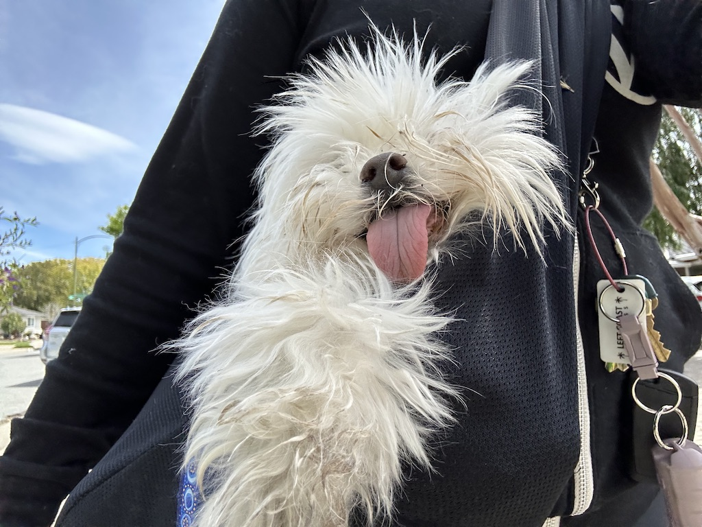
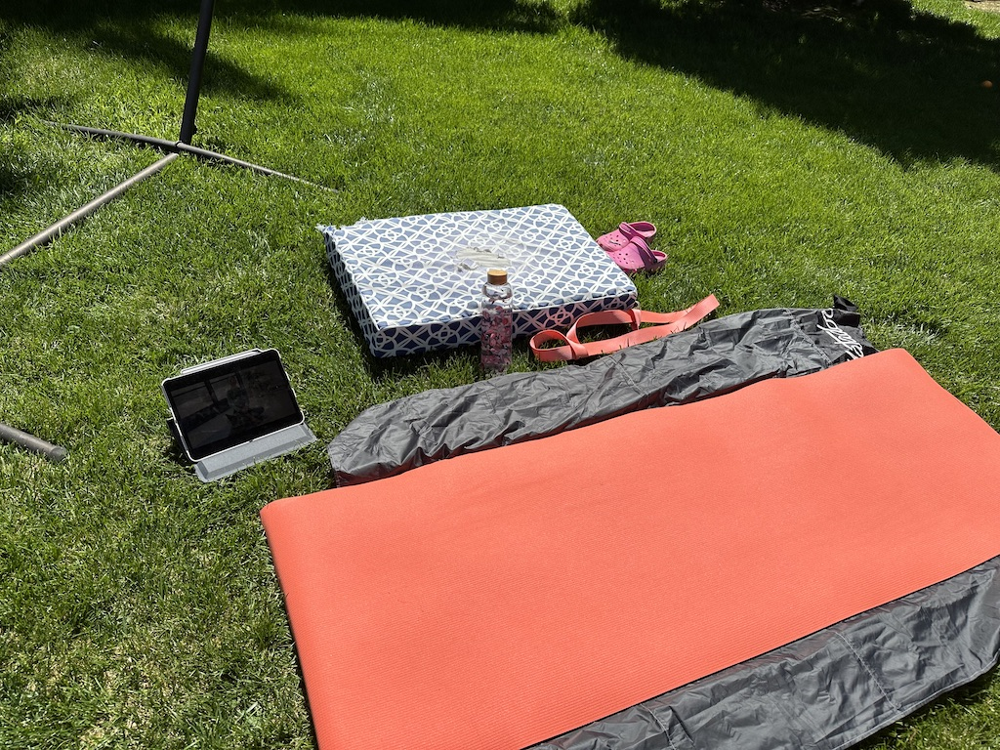

It's day nine of my 10 Hard Challenge. Why am I posting on day nine instead of waiting until tomorrow? I've already _"failed."_

## Epic Failure

If I had a fixed mindset, I would call this an epic failure. The challenge is supposed to be 75 days, and I already cut that down to 10 as an experiment. According to the challenge creator, Andy Frisella, you cannot modify the challenge in any way, and if you miss any one task by any amount, you fail and start back on day one. (You can learn more about what he says to say by listening to his podcast, Real AF.)

Playing by his rules, I failed on day one because I didn't drink a gallon of water. I failed on day seven by my rules because I did not complete my 45-minute outdoor workout. And on day eight, by drinking only 32 oz water, having caffeine, and a Truly (alcohol). And I am intentionally failing on day nine because I've decided to take it easy today.

## Epic Self-Discoveries

Looking at this instead with a growth mindset, while I did not complete the challenge according to his standards or mine, I did learn quite a lot.

First, if I set a difficult goal and then say meeting 50% of that goal counts as meeting that goal, I'm not going to meet that goal at 100%. For my 10-day challenge, I said I'd like to try for a gallon of water per day, but I would consider it a success if I drank 64 oz (half a gallon). Guess what? I drank 110 oz, 96 oz, 76 oz, 64 oz, 64 oz, 64 oz, 64 oz, and 32 oz. For reference, a gallon is 128 oz. I didn't even meet this on the first day, and by the fourth day, I was meeting only the lower goal.

Also, I'm not sure I _want_ to drink a gallon of water daily, and I'm sure that has something to do with my results here. Actually, looking at the entire challenge, there's a lot packed into it that, while designed to cultivate mental toughness, are things I don't want to do. I have a bit of a rebellious streak, and that part of me looks at the list and doesn't want to do it.

If we look past the water, why did I fail on days seven and eight? By day seven, I was feeling a bit overwhelmed, trying to fit everything in and keep up at work. I went to the gym with my personal trainer and did strength training for an hour in the morning. In the afternoon, I was focused on work and put off the outdoor workout. My main outdoor workouts had been taking the dogs for long walks, and Indy had to be carried on the third and fourth walks, but he also didn't want to be left at home. Excuses? Yes, very much so. But I was feeling mentally exhausted, and I decided I wasn't going to berate myself about it. As it turns out, it feels nice to be kind to myself.

<figure>

<figcaption>

Indy made me carry him!

</figcaption>

</figure>

On day eight, I was feeling sad, worried, and anxious, and I let that get to me. My go-to self-care for these feelings is caffeine, junk food, and alcohol. I'm not sure I really recognized that before.

### What Else Did I Learn?

I learned that I am capable of fitting in more exercise, but I have to be very intentional about it. I did not enjoy outdoor yoga at 6 pm when it was windy and starting to get cold, but it was very nice this afternoon while sunny and warm.

<figure>

<figcaption>

My outdoor yoga set up.

</figcaption>

</figure>

I also learned that I like reading bite-sized amounts from a non-fiction book daily, in addition to whatever other book(s) I'm reading.

Both the exercise and the water made me feel better. I watched less TV overall because the time for all those workouts had to come at the expense of doing something else.

My sleep also improved a bit. I'm unsure if this is from the exercise and water or because I abstained from caffeine and alcohol. Probably a bit of everything?

Also, intermittent fasting from 8 pm to 10 am was pretty easy, but I don't know if I saw any benefits.

## What Now?

Now, it's time for me to take all the things I've learned and develop my own plan for the future. What habits do I want to keep? What do I want to discard?

- I want to continue drinking more water.

- I want to continue exercising more. Maybe setting a goal for five days a week and shooting for quality over quantity.

- I will definitely keep on reading!

- I still want to give up caffeine for good, but this is a hard one for me.
