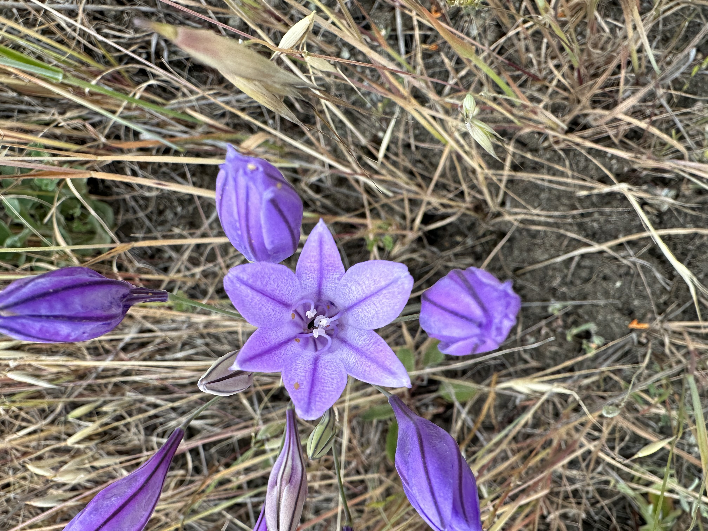
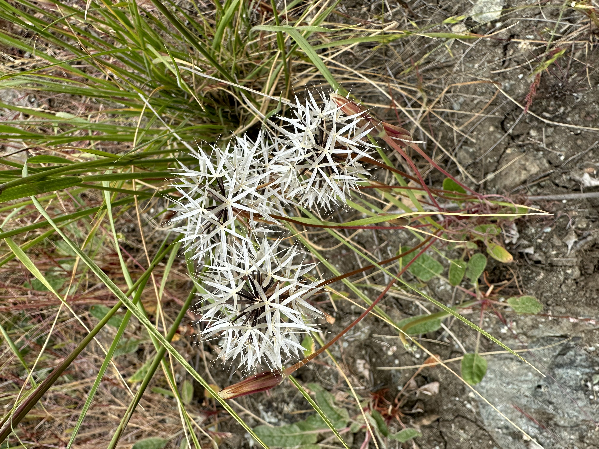
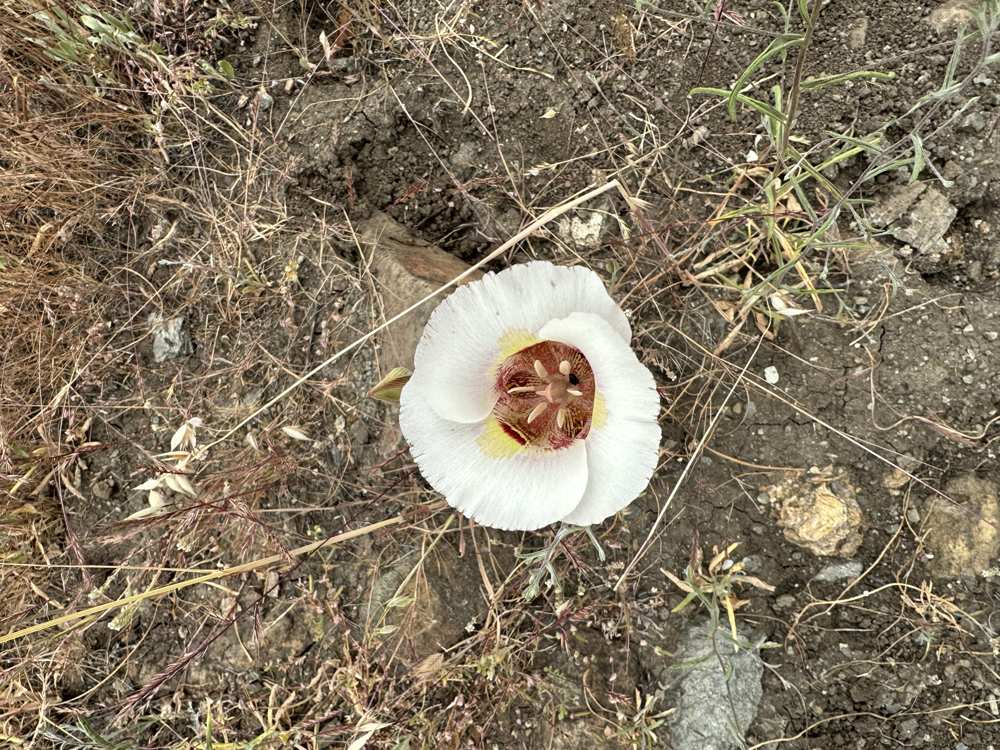
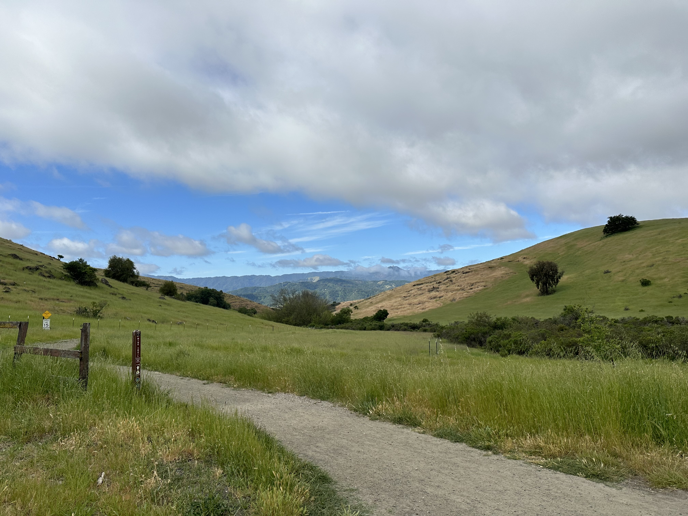
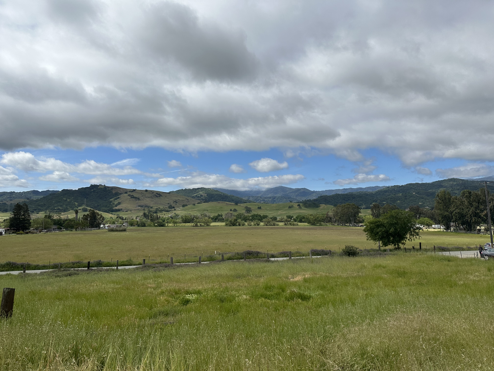
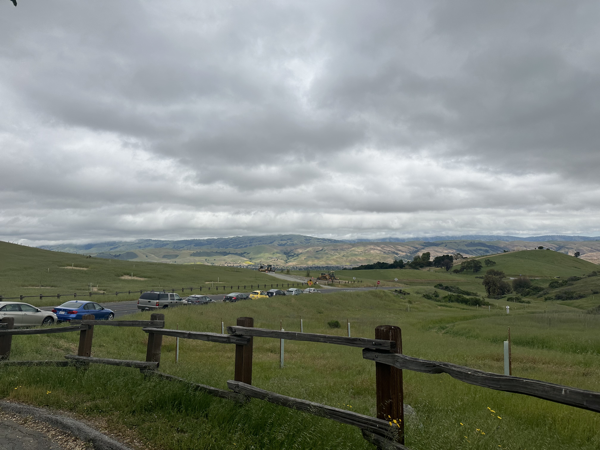
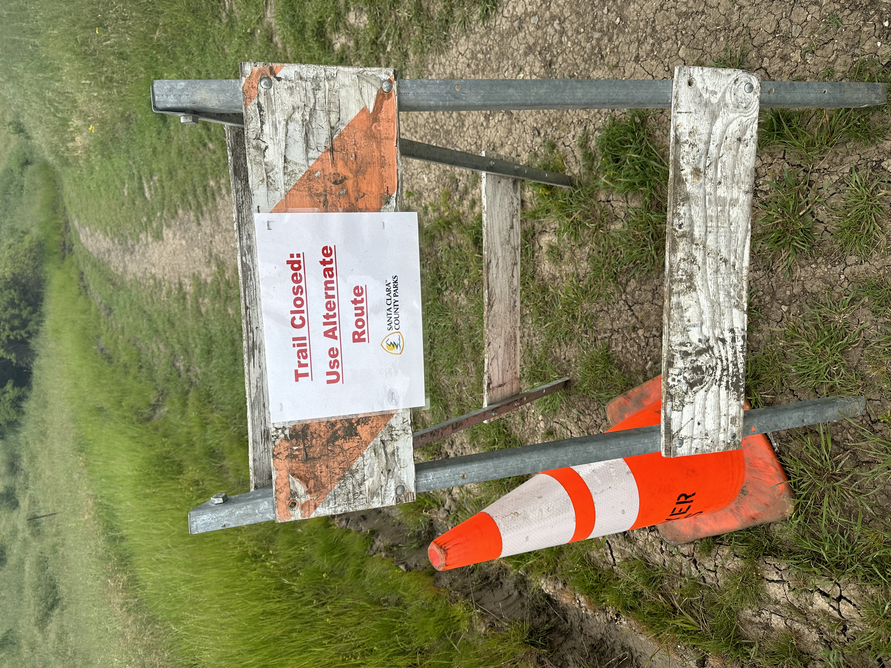

Today’s hike was at Santa Clara County Park.

<figure>

<figure>

<figcaption>

California Poppy

</figcaption>

</figure>

</figure>

We saw quite a lot of wild flowers! And it wasn’t very crowded.

At the start, we noticed a trail closed sign in one direction of our loop trail. We decided to go the other way and risk having to turn around.

We did not anticipate that the trail would be closed at 3.9/4 miles. Rebels that we are, we hiked the tenth of a mile that was closed. But only after asking people we saw coming from that direction if it was passable!

<figure>

<figure>

<figcaption>

Trail closed!

</figcaption>

</figure>

<figure>

<figcaption>

This is clearly why it was closed, but totally passable!

</figcaption>

</figure>

</figure>
