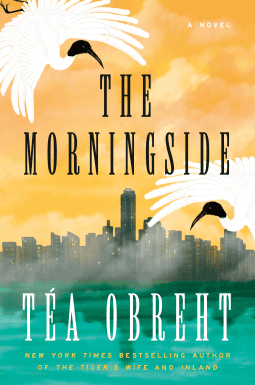

The Morningside1 by Téa Obreht is set in the not-so-distant future, where due to the destructive forces of human nature, the world has been ravaged by rising tides, food shortages, and unpredictable weather patterns.

Silvia and her mother have come to reside at The Morningside, what was once a luxury tower. As part of the Repopulation Program, they have been allowed to immigrate to this community. As part of the Posterity Initiative, everyone has limited access to rations, and eating meat is forbidden.

This is a novel about secrets, mourning what was, and how the world and humanity can recover what it lost. However, I felt it was trying to do and be too many things all at once. First, there's the post-apocalyptic aspect, and then on top of that, we have folklore, magical realism, and classism.

Overall, I just didn't get into the story or the characters. I would have enjoyed it more without the magical realism aspect, which I felt detracted from the other parts of the plot.

★★★

_Thanks to NetGalley and Random House for an advance copy in exchange for sharing my opinions. All opinions in this review are my own._

* * *
