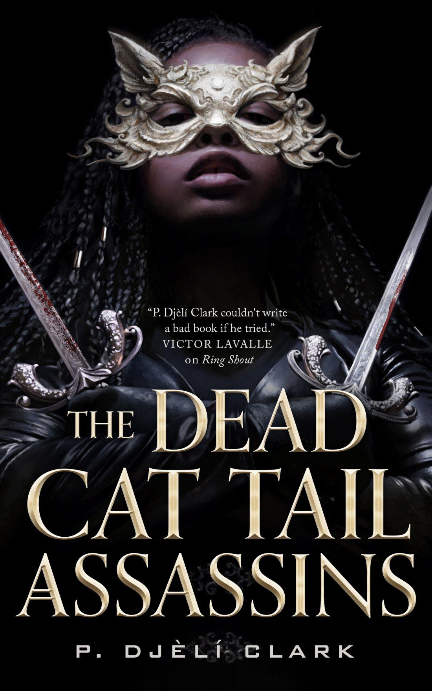

__The Dead Cat Tail Assassins__ by P. Djèlí Clark is a fantasy novella about a group of undead assassins. And no, they aren't cats. And no tails, either! The premise? In exchange for your memories and servitude (as an assassin), you can live (as a zombie) forever.

This is a quick read. While I wanted to love it, I just didn't. I found it a bit boring and lackluster. The ideas are great, but the execution is missing something.

★★

_Thanks to NetGalley and Tor Publishing Group for an advance copy in exchange for sharing my opinions. All opinions in this review are my own._
