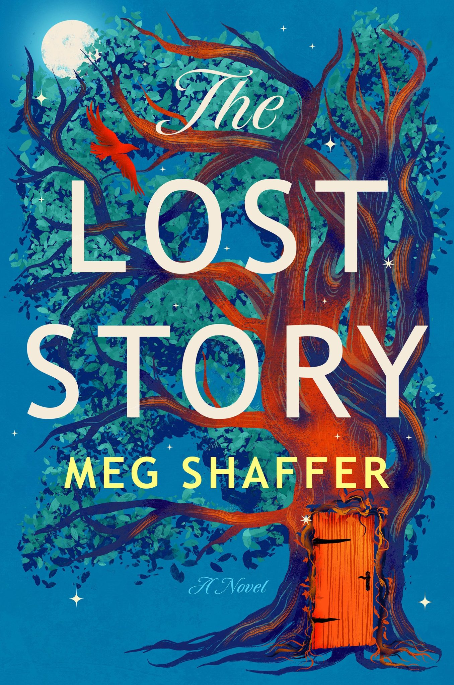

_The Lost Story_ by Meg Shaffer is a fantasy adventure novel. What if there was a magical realm ruled by a queen and her attending valkyries? What if lost boys and girls aren't really lost?

Inspired by **_The Chronicles of Narnia_**, this also reminded me of Alice in Wonderland. Why? Because not everything in Wonderland is wonderful.

While I enjoyed the novel, it has some issues preventing it from being a 4 or 5 star read.

The novel feels like a mishmash of a lighthearted, YA fantasy rom-com and a more serious adult novel touching on grief and abuse.

Additionally, I felt the world-building for Shanandoah could have been better. We learn most of the good bits only second and third-hand, in retellings and stories, and not through the direct action of the plot.

And finally, the novel includes a fairy godmother-like storyteller who inserts themselves between chapters. I didn't care for this, and I felt it mostly pulled you out of the (already) disjointed story.

★★★

_Thanks to NetGalley and Random House/Ballantine for an advance copy in exchange for sharing my opinions. All opinions in this review are my own._
