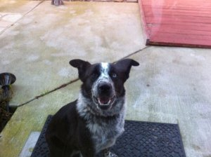

\[gallery type="rectangular" link="file" ids="1462,1461,1429,1433,1432,1424,1431,1451,1423,1426,1435,1422,1436,1434,1428,1630,1632,1633,1682,1681,1844,1971,1972,1973,1979,2093,2094,2092,2090,2089" orderby="rand"\]

<-- This is Pepper. He's the dog that started it all. He was found as a stray by a co-worker, who had him locked in the bathroom of her condo. I had a yard, so I agreed to keep him temporarily.

This also turned into finding a rescue that would take him. I did, and I was so happy to meet such nice, caring people, so I starting volunteering.

The rest is history.

_\*\* Not all of my foster dogs are pictured here. There were many fosters who were just "overnighters" for one night, and didn't get a good photo._

* * *

If you don't want to miss any updates, enter your email in the box below to subscribe. ꜜꜜꜜ

\[jetpack\_subscription\_form show\_subscribers\_total="false" button\_on\_newline="false" custom\_font\_size="16px" custom\_border\_radius="0" custom\_border\_weight="1" custom\_padding="15" custom\_spacing="10" submit\_button\_classes="" email\_field\_classes="" show\_only\_email\_and\_button="true"\]
