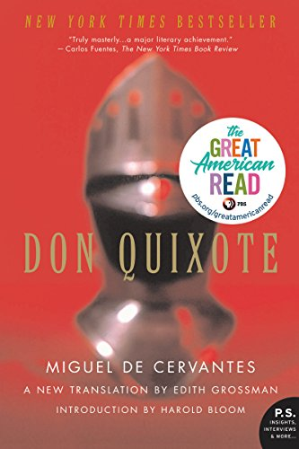

Here's some of the books I've been reading lately. This is not a complete list, just a short selection of some of the books I've enjoyed the most or found influential over the last few months.

### _Don Quixote_ by Miguel de Cervantes

This is a tough book to review. Don Quixote is pretty famous and considered by some as the best novel of all time. Certainly, its literary significance and impact cannot be ignored.

However, for me, this was not the most enjoyable book to read. It's almost 1000 pages, and it took me about 2 months to finish. For someone who reads an average of more than 1 book per week, that's a long time. Also, I read 5 other books during those 2 months, because _I needed a break from Don Quixote._

Alonso Quixano is, seemingly, an average man, who enjoys novels about chivalry and knights errant. Dissatisfied with his life, he decides to set out on an adventure and to take up arms in the name of chivalry. He calls himself Don Quixote de la Mancha, and enlists his neighbor, Sancho Panza, a rather simple farmer, to join him as his squire.

_A Court of Thorns and Roses_ by Sarah J. Maas

_Speak_ by Laurie Halse Anderson

_Becoming_ by Michelle Obama
